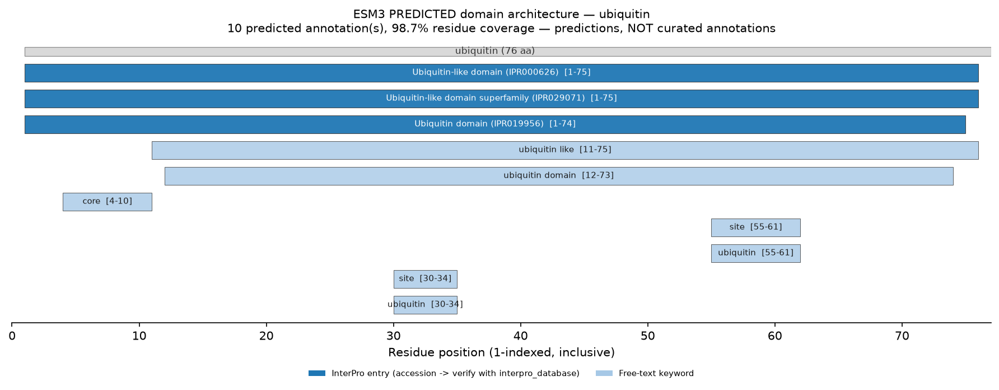
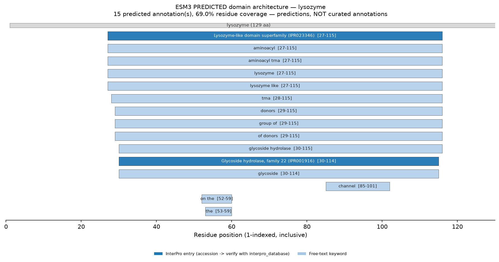
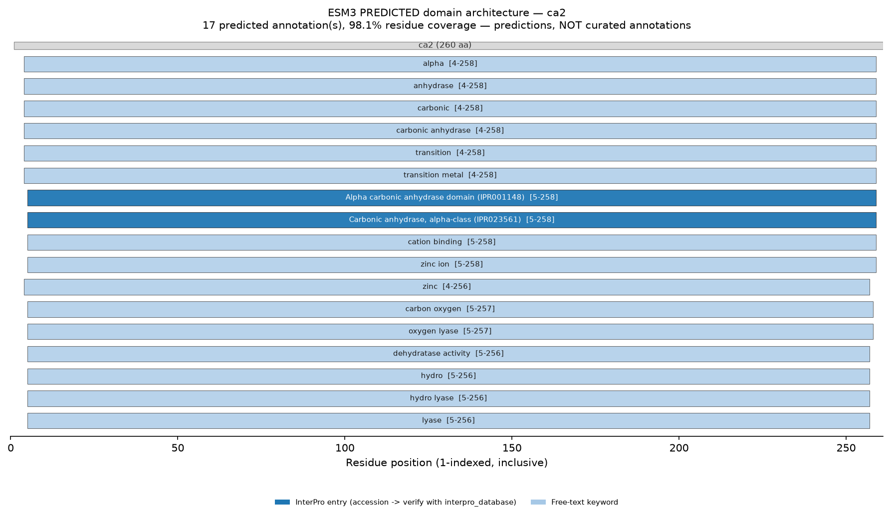

# Function Prediction Report: Ubiquitin, Lysozyme, Carbonic Anhydrase II

## Summary

ESM3's function track was asked to annotate three well-characterised proteins
from **sequence alone** — no homology search, no database hit. It recognised all
three correctly. Every one of the **seven** predicted InterPro accessions
resolved to a real InterPro entry whose name matches the emitted label, so the
domain-level calls are **CONFIRMED**. The keyword-level output is noisier: hen
egg-white lysozyme, whose InterPro entries are exactly right, also picked up a
spurious `aminoacyl trna` keyword. The lesson runs through every section below —
**count domains from `domain_architecture`, lead with verified InterPro entries,
and treat unverified keywords as hints.**

> [!NOTE] These labels are ESM3 **predictions** decoded from sequence. The
> "authoritative" column in each verification table comes from resolving the
> predicted accession with the `interpro_database` skill — that lookup, not the
> model, is what confirms the biology.

--------------------------------------------------------------------------------

## 1. Ubiquitin (76 aa) — whole-chain single domain

**Model / params**: esm3-open-2024-03, num_steps=8, temperature=1.0.

### Predicted domain architecture

| Span (1-indexed, incl.) | Length | # annotations | InterPro accessions |
| :--- | :--- | :--- | :--- |
| 1-75 | 75 | 10 | IPR000626, IPR019956, IPR029071 |

- **Coverage 0.99** (0.9868 — 75 of 76 residues). Whole-chain band (>0.8): ESM3
  recognises a domain spanning essentially the entire protein.
- **One domain, ten annotations.** The 10 labels collapse to a single
  `domain_architecture` span. This is the canonical "annotation count is not
  domain count" case.

### Predicted annotations

**InterPro entries (accession-bearing — the reliable signal):**

| Label | Span | Accession |
| :--- | :--- | :--- |
| Ubiquitin-like domain (IPR000626) | 1-75 | IPR000626 |
| Ubiquitin-like domain superfamily (IPR029071) | 1-75 | IPR029071 |
| Ubiquitin domain (IPR019956) | 1-74 | IPR019956 |

**Free-text keywords (corroboration only):** `core` [4-10], `ubiquitin like`
[11-75], `ubiquitin domain` [12-73], `site` [30-34], `ubiquitin` [30-34], `site`
[55-61], `ubiquitin` [55-61]. The two `site` spans (30-34, 55-61) are predicted
functional-site regions; they are keyword spans, so weight them lightly.


*Fig 1: ESM3-predicted domain architecture for ubiquitin. Dark blue = InterPro
entries; light blue = keywords. All three entries confirmed against InterPro.*

--------------------------------------------------------------------------------

## 2. Lysozyme (129 aa) — an embedded domain, plus keyword noise

**Model / params**: esm3-open-2024-03, num_steps=8, temperature=1.0.

### Predicted domain architecture

| Span (1-indexed, incl.) | Length | # annotations | InterPro accessions |
| :--- | :--- | :--- | :--- |
| 27-115 | 89 | 15 | IPR001916, IPR023346 |

- **Coverage 0.69** (0.6899). Partial band (0.3-0.8) — but this is *correct*, not
  weak: the mature chain's catalytic domain occupies residues 27-115 of 129, and
  ESM3 places the domain exactly there.

### Predicted annotations

**InterPro entries (accession-bearing — the reliable signal):**

| Label | Span | Accession |
| :--- | :--- | :--- |
| Lysozyme-like domain superfamily (IPR023346) | 27-115 | IPR023346 |
| Glycoside hydrolase, family 22 (IPR001916) | 30-114 | IPR001916 |

**Diagnostic keywords (corroborate the entries):** `lysozyme` [27-115],
`lysozyme like` [27-115], `glycoside hydrolase` [30-115], `glycoside` [30-114].

> [!WARNING] **Unverified keywords on this run:** `aminoacyl trna` [27-115],
> `aminoacyl` [27-115], `trna` [28-115], `donors` [29-115], `group of` [29-115],
> `of donors` [29-115], `on the` [52-59], `the` [53-59], `channel` [85-101].
> Lysozyme has nothing to do with tRNA. None of these carries an accession, so
> none survives verification. They are excluded from the headline finding — a
> live demonstration that ESM3 gets the accession-level biology right while still
> emitting keyword noise over the same span.


*Fig 2: ESM3-predicted domain architecture for lysozyme. The two dark-blue
InterPro entries are correct; the `aminoacyl trna` family of light-blue keywords
is spurious.*

--------------------------------------------------------------------------------

## 3. Carbonic Anhydrase II (260 aa) — large whole-chain domain

**Model / params**: esm3-open-2024-03, num_steps=8, temperature=1.0.

### Predicted domain architecture

| Span (1-indexed, incl.) | Length | # annotations | InterPro accessions |
| :--- | :--- | :--- | :--- |
| 4-258 | 255 | 17 | IPR001148, IPR023561 |

- **Coverage 0.98** (0.9808). Whole-chain band (>0.8): the alpha carbonic
  anhydrase domain spans essentially the full 260-residue chain.

### Predicted annotations

**InterPro entries (accession-bearing — the reliable signal):**

| Label | Span | Accession |
| :--- | :--- | :--- |
| Alpha carbonic anhydrase domain (IPR001148) | 5-258 | IPR001148 |
| Carbonic anhydrase, alpha-class (IPR023561) | 5-258 | IPR023561 |

**Diagnostic keywords (corroborate the entries — and here they are on-target):**
`carbonic anhydrase` [4-258], `alpha` [4-258], `zinc` [4-256], `zinc ion`
[5-258], `cation binding` [5-258], `transition metal` [4-258], `lyase` [5-256],
`oxygen lyase` [5-257], `hydro lyase` [5-256], `dehydratase activity` [5-256],
`carbon oxygen` [5-257]. These name the true catalysis: CA2 is a zinc
metalloenzyme (a carbon-oxygen `lyase` / carbonate dehydratase). The keywords
happen to be clean on this protein — but that is luck, not a rule (see lysozyme).


*Fig 3: ESM3-predicted domain architecture for carbonic anhydrase II. Both
InterPro entries confirmed; the zinc/lyase keywords match the true catalysis.*

--------------------------------------------------------------------------------

## 4. InterPro Verification (all seven accessions)

Each predicted `interpro_id` was resolved with the `interpro_database` skill,
e.g.:

```bash
uv run ./scripts/interpro_client.py fetch entry \
    --source_db interpro --accession IPR001916 --output ipr001916.jsonl
```

| Predicted accession | Authoritative InterPro name | Type | Verdict |
| :--- | :--- | :--- | :--- |
| IPR000626 | Ubiquitin-like domain | Domain | CONFIRMED |
| IPR019956 | Ubiquitin domain | Domain | CONFIRMED |
| IPR029071 | Ubiquitin-like domain superfamily | Homologous superfamily | CONFIRMED |
| IPR001916 | Glycoside hydrolase, family 22 | Family | CONFIRMED |
| IPR023346 | Lysozyme-like domain superfamily | Homologous superfamily | CONFIRMED |
| IPR001148 | Alpha carbonic anhydrase domain | Domain | CONFIRMED |
| IPR023561 | Carbonic anhydrase, alpha-class | Family | CONFIRMED |

Every accession exists and its name matches the ESM3 label. `IPR001916` is
*exactly* the family of hen egg-white C-type lysozyme, and `IPR001148` is the
correct domain for a human alpha-class carbonic anhydrase. You only know these
are confirmed because you looked them up — an invented accession would have read
identically until the `interpro_database` query returned 404.

--------------------------------------------------------------------------------

## 5. Limitations & Caveats

- **These are predictions.** *These are ESM3 MODEL PREDICTIONS decoded from
  sequence alone, not curated annotations. No homology search was performed and
  no database was consulted. Always present them as predictions, and resolve any
  predicted InterPro accession against the authoritative entry using the
  `interpro_database` skill before relying on it.*
- **No confidence score.** The function track returns labels and spans only.
  Coverage and the entry-vs-keyword split are the only confidence proxies.
- **Keywords are unreliable even when domains are right** — the lysozyme
  `aminoacyl trna` run proves it. Never build a claim on an unverified keyword.
- The function track does not predict structure (`esmfold2_structure_prediction`)
  or score mutations (`esmc_mutation_effect_scoring`).

## 6. Conclusion

On three textbook proteins ESM3 recognised the correct domain in every case, and
all seven predicted InterPro accessions were confirmed authoritative. The value
of the worked example is the *method* it forces: read one domain from
`domain_architecture` despite 10-17 annotations, verify each accession before
trusting it, and quarantine keyword noise like `aminoacyl trna`. Run this same
pipeline on a genuine orphan (the intended use case) and the verification step is
what tells you whether the predicted family is real biology — even when the
protein itself is uncharacterised.
