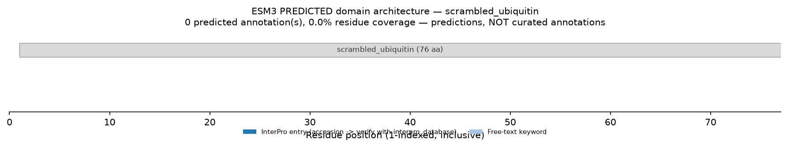

# Function Prediction Report: Scrambled Ubiquitin (76 aa) — No Confident Function

## 1. Summary

ESM3 returned **0 predicted annotations** (coverage 0.00) for a scrambled
ubiquitin. The function track does not recognise a domain in this sequence. This
is a **real signal, not a tool failure**: it is precisely what a non-protein
returns. The result is decisive because the *unscrambled* sequence, with the
identical amino-acid composition, gives 10 annotations at 0.99 coverage. Order —
the fold — is the only thing removed, and it is the only thing ESM3 was reading.

## 2. Sequence Context

- **ID / Length**: scrambled_ubiquitin / 76 aa
- **Provenance**: negative control — human ubiquitin (P0CG48) with residues
  shuffled by `scramble(UBIQUITIN, seed=0)`. Composition preserved, fold
  destroyed.
- **Model / params**: esm3-open-2024-03, num_steps=8, temperature=1.0. The
  temperature is in the valid 0.1-1.0 band, so the empty result is **not** an
  artefact of `temperature=0` (which would return zero annotations for *every*
  sequence, including real ubiquitin).

## 3. Result

| Metric | Real ubiquitin | Scrambled ubiquitin |
| :--- | :--- | :--- |
| Predicted annotations | 10 | **0** |
| Coverage | 0.99 (0.9868) | **0.00** |
| `domain_architecture` | one span, 1-75 | **none** |
| InterPro accessions | IPR000626, IPR019956, IPR029071 | **none** |

There is nothing to verify: with no accessions, the `interpro_database`
cross-check has no input. That absence is the finding.

*Fig 1: The sequence backbone carries no predicted annotation. Coverage 0.00 —
compare with the fully-covered ubiquitin bar in the positive example.*

## 4. Interpretation

Two readings are possible, and both are worth stating:

- **(a) Not a plausible protein.** This is the true situation here: a shuffled
  sequence has no fold. In the wild this reading covers scrambles, frameshifted
  ORFs, and assembly artefacts.
- **(b) Genuine dark matter.** A real protein whose fold lies outside ESM3's
  training data would return the same empty result. This is the case the skill
  exists for, and it cannot be distinguished from (a) on the function track
  alone.

**Corroboration.** The identical scramble raises ubiquitin's ESMC
pseudo-perplexity from **1.05 to 18.70** — an independent signal that the
shuffled chain no longer reads as a protein. When the function track returns
nothing, an orthogonal check like pseudo-perplexity or structure-prediction
confidence helps separate reading (a) from reading (b).

## 5. What This Does and Does Not Rule Out

- **Does show:** ESM3 sees no recognisable domain in this sequence. Combined with
  the pseudo-perplexity jump, the evidence points to "not a real protein".
- **Does not show:** an empty result alone does **not** prove a sequence is
  non-functional — a novel natural fold outside the training distribution would
  look identical. If function genuinely matters for an orphan that comes back
  empty, follow up with structure prediction and a sensitive HMM/profile search.
- **Integrity:** do not manufacture a domain to fill the gap. "No recognisable
  function" is the correct, reportable answer.

## 6. Conclusion

Scrambling ubiquitin collapses ESM3's output from a confident, verified,
whole-chain ubiquitin domain (10 annotations, 0.99 coverage) to **nothing**
(0 annotations, 0.00 coverage) on a composition-identical sequence. The empty
result is the point of the example: it is what "no confident function" looks
like, it is a valid scientific finding, and it must never be dressed up as a
failure or backfilled with a speculative annotation.
