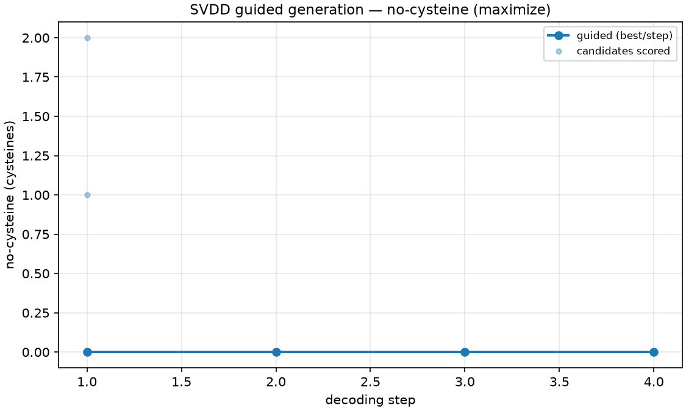
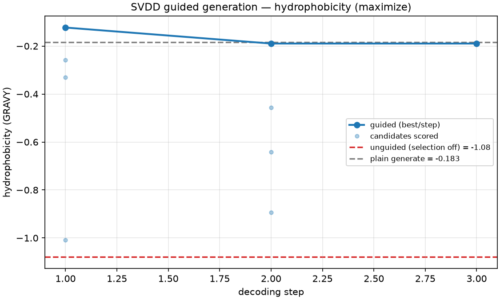

# Guided Generation Report: no-cysteine and hydrophobicity (L=48)

*Generated with the `esm3-guided-generation` skill (SVDD, Li et al. 2024).*

## Summary

Two small runs on 48-residue designs demonstrate the two things guided decoding
is good for and where its limits are:

-   **no-cysteine (`generate`)** drove the cysteine count to **exactly 0**, from
    an unguided baseline of 1.67 cysteines per 48-mer. The objective trajectory
    was flat at zero -- `[0, 0, 0, 0]` -- because the cheap, hard target is hit
    at the first step and held. This is guided decoding used as a **constraint
    solver**, and it works cleanly.
-   **hydrophobicity (`compare`)** raised GRAVY versus the unguided ablation:
    **+0.132 vs +0.005 averaged over two seeds** (guided wins the honest test).
    But the per-seed result is noisy -- one seed won by +0.89, the other *lost*
    by -0.64 -- and on this tiny budget the guided design only **tied a single
    plain generation**. This is the "do not over-claim on a small budget"
    lesson, shown in real numbers.

Neither design is a good protein. Both fold poorly (the no-cysteine design
reaches pTM 0.31), because unconditional ESM3 48-mers are essentially extended
chains regardless of guidance. Guidance moved the *sequence-level objective*,
which is exactly and only what it was asked to do.

## How the numbers were produced -- the SVDD loop

Each design starts as a fully-masked chain of `_`. Every decoding step, for each
of `--num-samples-per-step` candidates:

1.  **PROPOSE** -- draw a full ESM3 completion of the current prompt (1 API
    call).
2.  **COMMIT** -- lock in a random slice of the newly-filled positions; the rest
    return to `_`. This slice is the candidate's partial state.
3.  **DENOISE** -- complete the candidate *again* so the score reflects what it
    actually locked in (1 API call; skipped on the final step, where nothing is
    masked).
4.  **SCORE** -- evaluate the objective on the denoised prediction. Keep the
    best-ranked candidate; its partial state carries into the next step.

The final step commits every remaining position, so the returned sequence is
scored on the **true** objective, not an estimate. The unguided ablation is the
identical loop with step 1 drawing a single candidate that is kept
unconditionally -- an exact ablation of *selection*, which is why any
guided-minus-unguided difference is attributable to guidance alone.

--------------------------------------------------------------------------------

## Run 1 -- no-cysteine (a hard, cheap target)

```
generate --length 48 --objective no-cysteine \
         --num-decoding-steps 4 --num-samples-per-step 3 --seed 0
```



**Result.** Final sequence (48 aa):

```
MMKKLILAALAVFVVFASVAAHAQASSRQILTLSNEKGPVKGAGVVVS
```

| Quantity | Value |
|---|---|
| Cysteines | **0** (target met) |
| `objective_trajectory` | `[0, 0, 0, 0]` |
| GRAVY | +0.883 |
| Isoelectric point | 10.46 |
| pTM / mean pLDDT | 0.309 / 0.584 |
| Radius of gyration | 20.2 A |
| API calls | 22 |

**Reading the trajectory.** The blue best-per-step line sits at 0 cysteines the
whole way. The story is in the faint candidate dots at **step 1**: the three
proposed candidates carried **2, 0, and 1** cysteines (`candidate_scores`
`[-2, 0, -1]`), and selection kept the cysteine-free one. Once a clean slice is
committed, every later completion stays clean, so steps 2-4 show all candidates
at 0. A flat-at-optimum trajectory like this means the objective was **easy at
these settings** -- not that guidance did nothing, but that four candidates were
already enough to find a cysteine-free path. Judge this against the unguided
baseline of 1.67 cysteines per 48-mer, not against the flat line.

The design folds poorly (pTM 0.31, Rg 20 A) -- expected for a short
unconditional ESM3 design, and irrelevant to the no-cysteine objective, which
never asked about structure.

--------------------------------------------------------------------------------

## Run 2 -- hydrophobicity (guided vs unguided, the honest test)

```
compare --length 48 --objective hydrophobicity \
        --num-decoding-steps 3 --num-samples-per-step 4 --seed 0
```



**Result, seed 0.** Maximising GRAVY (higher = more hydrophobic):

| Arm | GRAVY | Sequence |
|---|---|---|
| **guided** | **-0.190** | `SPAPPDEVIRLSALTEAQIAALVRVKAAADHAMQSGGVPDSGEEANHG` |
| unguided (selection off) | -1.079 | `LQAIAELRRMGTELVGARRRKDRSSKLSKSHAKGQDEVGASVKPKEKP` |
| plain generate | -0.183 | `LEDGATVYLKYLEIDPVSSNSRHAIEDRGDSLSYTESASPASVYLITV` |

Guided beats the unguided ablation by **delta +0.89 GRAVY**
(`guided_better_than_unguided: true`). In the plot the guided line ends at
-0.19, far above the red unguided baseline (-1.08); the grey plain-generate line
(-0.18) sits right on top of the guided result.

**Reading the trajectory.** The guided best-value went `[-0.123, -0.190,
-0.190]`. It did **not** climb monotonically -- it nudged *down* from step 1 to
step 2 before plateauing -- because the per-step value is a single Monte-Carlo
estimate on a partial sequence, and the final step re-scores on the true
sequence. The take-home is not the shape of the guided curve but its gap to the
unguided baseline. The candidate spread at step 2 (dots at -0.19, -0.46, -0.64,
-0.89) shows selection had genuinely bad candidates to reject.

### The honest part: one seed is not a result

GRAVY is stochastic, so the run was repeated at seed 1. The two seeds disagree:

| | seed 0 | seed 1 | **2-seed mean** |
|---|---|---|---|
| guided | -0.190 | +0.454 | **+0.132** |
| unguided | -1.079 | +1.090 | **+0.005** |
| plain generate | -0.183 | +0.029 | -0.077 |
| guided > unguided? | yes (d +0.89) | **no** (d -0.64) | **yes (d +0.13)** |

Guidance improves GRAVY **on the mean** (+0.132 vs +0.005), but **seed 1
inverts**: its unguided arm happened to draw a very hydrophobic sequence (+1.09)
that beat the guided design (+0.45). This is exactly why the skill mandates
running `compare`, and averaging a noisy objective over >= 2 seeds, before
claiming guidance worked. A report that showed only seed 1 would have "proven"
that guidance *hurts* -- a lucky draw dressed up as a result.

**Do not over-claim on a small budget.** With 3 steps x 4 samples the selection
sees at most a dozen candidates. That is enough to (a) crush the unguided
ablation, whose single unconditional draw is often quite polar, and (b) win on
the 2-seed mean -- but **not** enough to reliably beat a *plain generation*
(guided -0.190 vs plain -0.183 at seed 0; they tie). If you need to genuinely
outperform plain generation on a noisy objective, raise `--num-samples-per-step`
and average more seeds -- and price the credits first.

--------------------------------------------------------------------------------

## Cost accounting

Biohub bills **one credit per API call**; free-tier keys get **100 credits per
day**, shared across every ESM skill. The formula (from SKILL.md):

```
guided run:    calls = steps x samples x (2 + F)  -  samples   [+ 1 final fold]
unguided run:  calls = steps                                   [+ 1 final fold]

F = 1 if the objective OR constraint reads a structural metric (ptm/plddt/rg),
    because every candidate must then be folded. F = 0 for sequence-only
    objectives (no-cysteine, hydrophobicity, isoelectric-point).
```

Both objectives here are sequence-only, so **F = 0** and no candidate was
folded.

| Run | Arithmetic | Calls |
|---|---|---|
| no-cysteine, 4 x 3 | 4*3*2 - 3 + 1 final fold | **22** |
| hydrophobicity `compare`, 3 x 4 | guided (3*4*2 - 4 = 20) + unguided (3) + plain (1) | **24** |

The `- samples` term is the final step, which needs no DENOISE call (the
candidate is already complete). The `compare` run does **not** fold its three
final sequences, because a sequence-only objective does not need a structure --
folding them would waste 3 credits.

For contrast, the fold-based `ptm` objective adds `F = 1`: an otherwise
identical 2 x 2 run costs 11 calls, and the vendor tutorial's settings (L=256,
32 steps x 10 samples, pTM) would cost **951** -- nearly ten days of quota. Cost
does not depend on `--length`; scale length freely, but do the steps x samples
arithmetic before every run.

## Conclusion

-   **Guided decoding is a reliable constraint solver for cheap, hard,
    sequence-level targets.** The no-cysteine run hit 0 cysteines against a 1.67
    baseline, deterministically, for 22 credits.
-   **For a noisy continuous objective it is a modest, real, but easily
    over-stated improvement.** Guidance beat the unguided ablation on the 2-seed
    GRAVY mean (+0.132 vs +0.005) but only tied a single plain generation, and
    one of the two seeds inverted. Always run `compare`; always average a
    stochastic objective over >= 2 seeds; never quote a single lucky seed.
-   **Guidance optimises the sequence objective, nothing else.** Both designs
    fold poorly, as unconditional ESM3 48-mers do. That is not a guidance
    failure -- it was never asked to fold well.

*This analysis used the `esm3-guided-generation` skill.*
