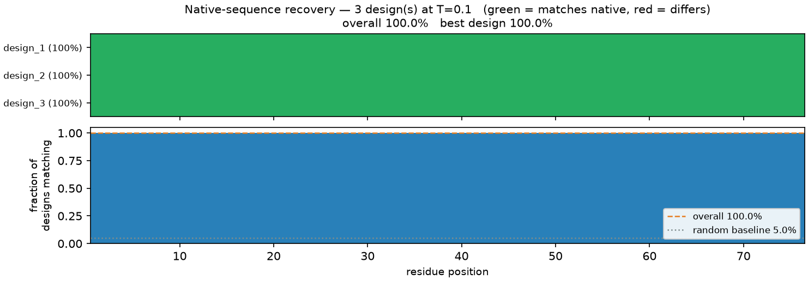

# Inverse-Folding Design Report: Ubiquitin Backbone (76 aa)

*Produced with the `esm3-inverse-folding` skill.*

## 1. Summary

A 76-residue backbone — human **ubiquitin** (P0CG48), folded with ESMFold2
(`esmfold2-fast-2026-05`) to **pLDDT 0.820 / pTM 0.781** — was used as the design
target. Three sequences were designed for it with ESM3 (`esm3-open-2024-03`) at
**T=0.1**, then each was re-folded and scored against the target by
self-consistency.

- **The designs adopt the target fold.** All three re-fold to the backbone with
  **scTM 1.000** and **scRMSD ~0.00 Å** (refold pLDDT 0.820) — a clean PASS by
  the `scTM > 0.8` bar. `3/3` designs pass.
- **Native-sequence recovery is 100%.** Every one of the 76 positions is
  recovered by every design (chance is ~5%). At T=0.1 the backbone determines the
  sequence so tightly that all three independent decodes return the *identical*
  native ubiquitin sequence.
- **The scorer is not rigged.** A decoy structure — the same atoms with the
  residue correspondence shuffled — was pushed through the identical scoring
  function and **rejected at scTM 0.078** (scRMSD 15.3 Å). So the 1.000 above is
  a real match, not a scorer that always returns 1.0.

**Bottom line:** this design is trustworthy *because* self-consistency passed and
the decoy failed — not because ESM3 returned a confident-looking sequence. A
design without these scores is worthless; the model returns a fluent sequence for
any backbone, including ones it has completely failed to solve.

## 2. How the design was produced

The dedicated `/inverse_fold` endpoint **does not exist for this API key** — every
reachable model (`esm3-open-2024-03`, `esmfold2-*`, `esmc-*`) answers HTTP 422
*"does not support the 'inverse_fold' endpoint."* Inverse folding therefore goes
through the ESM3 **generate** endpoint with the coordinates supplied and the
sequence track left masked:

```python
client.generate('sequence', model='esm3-open-2024-03',
                coordinates=coords_atom37, num_steps=76, temperature=0.1)
```

The backbone was stripped to its **N, CA, C, O** atoms before it was sent
(`conditioning: backbone_only(N,CA,C,O)`). ESM3 reads only the N–CA–C frame, so
stripping sidechains is a numeric no-op that *guarantees* no sidechain identity
leaks into the design — the 100% recovery below is genuine inverse folding, not
the model reading the answer off the input.

## 3. Self-consistency — the validation loop

Each design is re-folded with an **independent** model (ESMFold2), and the
refolded CA trace is superposed on the target. This is the step that makes a
design trustworthy.

| Rank | Design    | scTM  | scRMSD (Å) | Refold pLDDT | Verdict |
| :--- | :-------- | :---- | :--------- | :----------- | :------ |
| 1    | design_1  | 1.000 | 0.00       | 0.820        | PASS: very likely adopts the target fold |
| 2    | design_2  | 1.000 | 0.00       | 0.820        | PASS: very likely adopts the target fold |
| 3    | design_3  | 1.000 | 0.00       | 0.820        | PASS: very likely adopts the target fold |

*(Exact values: scTM `0.9999999999999916`; scRMSD `2.8e-07 Å`; refold pLDDT
`0.81985`; refold pTM `0.781`.)*

**Decoy control (no API calls).** scTM saturates at 1.000 here because the design
*is* ubiquitin, so it re-folds onto the target exactly. That alone cannot tell a
working scorer from one that always returns 1.0. So a deliberately wrong structure
— the same atoms with the residue correspondence shuffled (seed 0) — was scored by
the same function:

| Structure                     | scTM      | scRMSD (Å) | Reading |
| :---------------------------- | :-------- | :--------- | :------ |
| Best design (refolded)        | **1.000** | 0.00       | Adopts the fold |
| Shuffled-correspondence decoy | **0.078** | 15.3       | **Rejected** — scorer discriminates |

The 0.92 gap between a true match (1.000) and a decoy (0.078) is the evidence that
scTM 1.000 means something here.

## 4. Native-sequence recovery (visual analysis)



**Interpretation:**

- **Top panel (agreement matrix):** one row per design, one column per residue.
  Every cell is **green** (matches native) — all 76 positions are recovered by all
  3 designs. No red anywhere.
- **Bottom panel (per-position agreement):** every bar sits at **1.00**. The
  orange dashed line marks the overall recovery (**100.0%**); the grey dotted line
  marks the random amino-acid baseline (**5.0%**). The signal is pinned two full
  panels above chance.
- **Numbers:** overall recovery **100.0%**, best and worst design both **100.0%**,
  **76/76** positions recovered by every design, none never-recovered.

Recovery this high is expected for an ESM-predicted backbone at T=0.1: the target
came from folding ubiquitin's own sequence, so the sequence that best explains the
backbone *is* ubiquitin. **Recovery is a benchmark, not a quality score** — for a
de novo backbone there is no native sequence to recover, and scTM (not recovery)
is what decides whether a design works.

## 5. Diversity — resample, don't overheat

At **T=0.1** the three decodes are **byte-identical** (`1/3` unique, mean pairwise
identity 100%): the backbone pins the sequence, so a cold decode leaves nothing to
sample. Genuine diversity comes from **resampling at a moderate temperature**, not
from a hotter decode:

| Temperature | Unique / 3 | Mean pairwise identity | Native recovery (mean) |
| :---------- | :--------- | :--------------------- | :--------------------- |
| 0.1         | 1          | 100.0%                 | 100.0%                 |
| 1.0         | 3          | 94.7%                  | 97.4%                  |

T=1.0 buys real diversity (3 distinct sequences, 94.7% identity) at a negligible
cost to recovery (97.4% mean, 96.1% worst). Do **not** chase diversity by cranking
the temperature past ~1.5 — that destroys the design (recovery falls to ~40% at
T=2.0). To explore more of the sequence space, raise `--num-samples` at a moderate
temperature.

## 6. Conclusion

The three designs are trustworthy **because they were validated**, not because
they look plausible:

1. **Self-consistency passed** — scTM 1.000, scRMSD ~0 Å, all 3 designs (§3).
2. **The decoy control failed** — scTM 0.078, proving the scorer discriminates.
3. **Recovery is 100%** against a 5% chance baseline (§4), consistent with an
   ESM-predicted native backbone.

Had only `design` been run, the output would have been three confident sequences
with **no evidence they fold** — the model returns exactly that for a backbone it
has solved and for one it has ruined. **Never report, rank, or hand over an
inverse-folding design without its self-consistency scores.**

*Reproduce (free, from cassettes — no key, no credits):*

```bash
export BIOHUB_CASSETTE=$PWD/evals/cassettes
export BIOHUB_CASSETTE_MODE=replay
# fold ubiquitin -> ubiquitin_backbone.pdb, then:
uv run --no-project skills/esm3_inverse_folding/scripts/inverse_fold.py \
    self-consistency --pdb ubiquitin_backbone.pdb \
    --num-samples 3 --temperature 0.1 --output self_consistency.json
```
