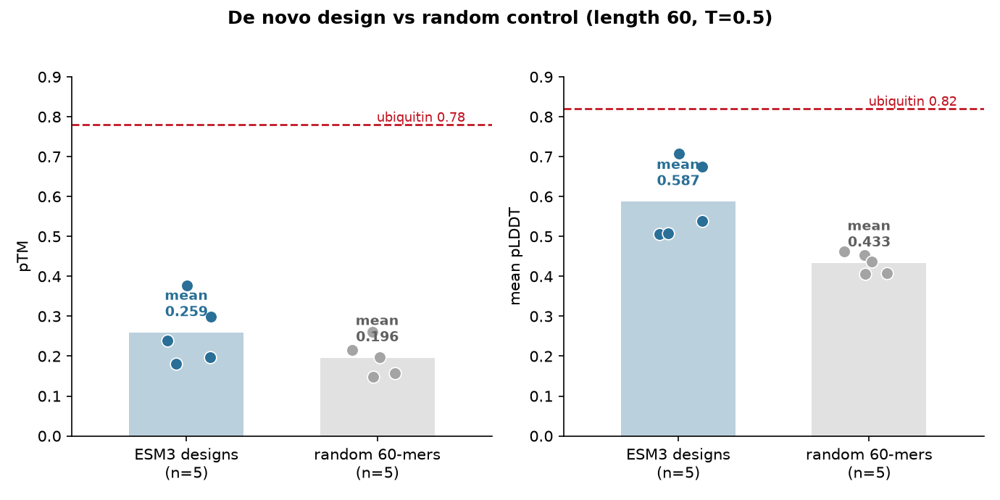

# Design Report: De Novo 60-Residue Protein

## 1. Summary of Findings

A de novo design campaign with **ESM3** (`esm3-open-2024-03`) produced five
candidate 60-residue proteins with no conditioning (`generate --length 60
--num-samples 5`, T=0.5). Every sample was folded with ESMFold2
(`esmfold2-fast-2026-05`) and ranked by pTM. The designs are **more foldable than
a random-string control but only modestly so**: mean design pTM **0.259** vs a
random-60-mer floor of **0.196**, and mean pLDDT **0.587** vs **0.433** (n=5
each). This is the expected outcome for a short, unconditioned prompt — pTM is
harshly penalised below ~80 residues — and it is well short of the ~0.78 a real
protein of this length reaches. The top design (pTM 0.376) also carries a
low-complexity poly-Lys tail. **This is a usable starting point, not a finished
mini-protein**; conditioning or greater length would be needed for a confident
fold.

## 2. Design Setup

- **Objective**: a 60-residue de novo protein, from scratch
- **Subcommand / conditioning**: `generate`, prompt = 60 masked positions (no
  sequence, structure, SS8, or SASA constraints)
- **Length**: 60
- **Samples drawn**: 5, temperature 0.5
- **Models**: `esm3-open-2024-03` (design) / `esmfold2-fast-2026-05` (QC fold)

## 3. Ranked Designs (QC Metrics)

| Rank | Design | pTM | mean pLDDT | min pLDDT | Notes |
| :--- | :----- | :--- | :--------- | :-------- | :---- |
| 1 | design_1 | 0.376 | 0.708 | 0.489 | best pTM; **low-complexity poly-Lys tail** |
| 2 | design_2 | 0.299 | 0.674 | 0.510 | charged, more varied composition |
| 3 | design_3 | 0.239 | 0.506 | 0.398 | Ala/Leu-repetitive |
| 4 | design_4 | 0.198 | 0.539 | 0.451 | Gly/Ala repeats |
| 5 | design_5 | 0.181 | 0.507 | 0.442 | — |

**Floor comparison**: mean design pTM **0.259** vs random-control floor
**0.196**; mean design pLDDT **0.587** vs **0.433** (n=5 each). Designs clear the
floor on both metrics — but note the distributions overlap: the best random
control (pTM 0.261, see `random_baseline/`) edged above the *mean* design. The
signal at length 60 is weak, which is why five samples and a mean comparison are
used rather than a single draw.

## 4. Top Design

- **Sequence** (`design_1`):
  `MEKILLNDLLEKITLEERKALIDEANEKIIKKEEDKKKKEKEKKKKKEKEKKKKKQDKKK`
- **pTM / pLDDT**: 0.376 / 0.708
- **Low-complexity / artifact check**: **flagged.** The C-terminal
  `...KKEEDKKKKEKEKKKKKEKEKKKKKQDKKK` is a long, low-complexity poly-Lys run.
  Even the highest-pTM design in the set is not a clean sequence; this is a
  documented property of ESM3's short unconditioned samples, not a fold failure.

*Fig 1: The five ESM3 designs (teal) against five uniformly-random 60-mers
(gray) on pTM (left) and mean pLDDT (right). Bars are means; points are
individual samples. Designs sit above the random floor on both metrics but well
below the ubiquitin ceiling (red dashed, 0.78 / 0.82). The overlap of the point
clouds is the honest picture at length 60.*

## 5. Interpretation

Read against the calibration table, mean pTM 0.259 is exactly what an
unconditioned 60-mer should give: above the random floor (0.196), far below a
real protein (0.78). The campaign therefore **succeeded at its statistical test**
(ESM3 adds foldability over a random generator) but **did not produce a
confidently-folded protein** — no design exceeds pTM 0.5, and the best is
low-complexity. This is not a defect to hide; it is the expected behaviour of the
open model on the hardest possible prompt (short, no conditioning). To get a
confident fold, the correct next steps are to **condition the design** (a motif,
an SS8 plan, or a SASA profile — the `motif_scaffold/` example reaches pTM 0.98),
use `chain-of-thought` (pTM 0.35 here at the same length), or **design longer**.

## 6. Limitations

These are **computational designs, not validated proteins**. Foldability
predictions (pTM/pLDDT) say nothing about expression, stability, solubility, or
function. pTM is length-sensitive: a 60-mer's 0.376 is not comparable to a
200-mer's. `design_1`'s low-complexity tail would likely need redesign or
filtering before any downstream use. If the user actually wants the structure of
a known sequence, that is `esmfold2-structure-prediction`; a sequence for a known
backbone is `esm3-inverse-folding`.

## 7. Conclusion

ESM3 de novo design at length 60 produces samples that are measurably more
foldable than random strings (mean pTM 0.259 vs 0.196) but not confidently
folded, and the top sample is low-complexity. **Verdict: a valid but modest
starting point; condition or lengthen for a usable design.** Designs produced
with ESM3; cite `hayes2024simulating`.

*This report was produced with the `esm3-protein-design` skill.*
