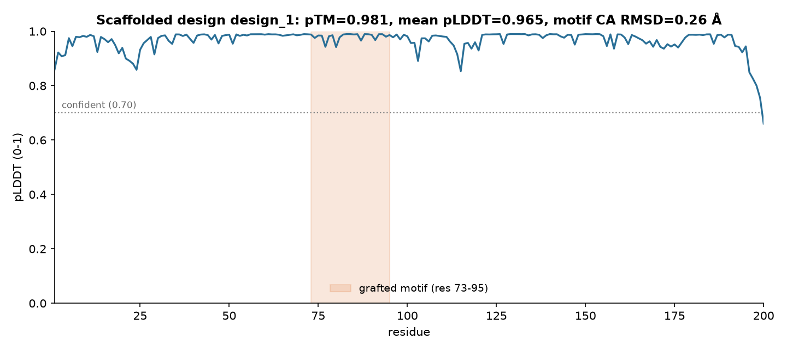

# Scaffold Report: 1ITU Active-Site Motif into a 200-Residue Protein

## 1. Summary of Findings

Using **ESM3** (`esm3-open-2024-03`), the 23-residue active-site motif of renal
dipeptidase (PDB **1ITU**, chain A, author residues 124-146,
`VEGGHSIDSSLGVLRALYQLGMR`) was grafted into a newly designed **200-residue**
protein (`scaffold-motif ... --scaffold-length 200 --motif-start 73
--num-samples 2`, T=0.5). Both designs were folded with ESMFold2
(`esmfold2-fast-2026-05`). **The graft succeeded on both required tests.** The
top design folds to **pTM 0.981 / mean pLDDT 0.965**, and its motif CA trace
superposes on the original crystal motif at **0.26 Å** — sub-Ångström, i.e. the
active-site geometry is essentially unchanged. Both samples kept the motif
verbatim; RMSDs were 0.26 Å and 0.28 Å. This is a dramatic contrast with
unconditioned de novo design at this API (mean pTM ~0.26): **conditioning on a
rigid motif is what makes the fold confident.**

## 2. Design Setup

- **Motif**: `VEGGHSIDSSLGVLRALYQLGMR` (23 residues), from PDB 1ITU chain A,
  author residues 124-146 (renal dipeptidase)
- **Scaffold**: 200 residues, motif placed at positions 73-95 (1-indexed)
- **Samples drawn**: 2, temperature 0.5
- **Models**: `esm3-open-2024-03` (design) / `esmfold2-fast-2026-05` (QC fold)

## 3. Ranked Designs (QC Metrics)

| Rank | Design | pTM | mean pLDDT | Motif verbatim | Motif CA RMSD (Å) |
| :--- | :----- | :--- | :--------- | :------------- | :---------------- |
| 1 | design_1 | 0.981 | 0.965 | true | 0.26 |
| 2 | design_2 | 0.979 | 0.958 | true | 0.28 |

Both designs fold confidently and preserve the motif; the campaign is
reproducible across samples, not a single lucky draw.

## 4. Motif Preservation (the two independent checks)

- [x] **Sequence**: the motif appears verbatim at the requested offset
  (`motif_verbatim` = true; grafted substring = `VEGGHSIDSSLGVLRALYQLGMR`,
  positions 73-95). Independently confirmed to match the 1ITU crystal residues.
- [x] **Geometry**: motif CA RMSD = **0.26 Å** (rank 1), 0.28 Å (rank 2) →
  **excellent** (< 1 Å). A verbatim motif with high RMSD would be a failed graft;
  here the geometry is held essentially at the crystal conformation.

*Fig 1: Per-residue pLDDT of the top design (`design_1`, pTM 0.981). The grafted
motif (residues 73-95, shaded) sits among the highest-confidence regions of the
protein, and the whole 200-residue chain is folded confidently (pLDDT well above
the 0.70 line except for short terminal dips). The motif was held in place
without destabilising the surrounding invented scaffold.*

## 5. Interpretation

Both certificates are green. The whole protein folds confidently (pTM 0.981,
pLDDT 0.965), and — separately — the functional motif's backbone geometry is
preserved to 0.26 Å. Neither alone would be enough: a high pTM with a distorted
motif would be a good-looking protein that lost its active site, and a
low-RMSD motif inside a poorly-folded scaffold would be a fragment, not a
protein. Because both hold, this is a genuine scaffold. The result also makes the
skill's central point concrete: conditioning on 23 rigid residues took ESM3 from
"barely above the random floor" (unconditioned 60-mer) to "near-perfect fold"
(200-mer), because the motif anchors the fold and the model only has to invent a
compatible environment.

## 6. Limitations

**Geometry preserved is not function validated.** The design holds the active-site
motif in the crystal conformation, but whether the protein is catalytically
active, expressible, stable, or soluble is untested here — those are wet-lab
questions, and function can be *predicted* (not proven) with
`esm3-function-prediction`. The RMSD is a CA superposition (Kabsch); side-chain
rotamers and the catalytic machinery beyond the backbone are not assessed. These
remain **computational designs**.

## 7. Conclusion

The 1ITU active-site motif was successfully scaffolded into a novel 200-residue
protein: **pTM 0.981, motif CA RMSD 0.26 Å, motif verbatim** — a confident fold
with the functional geometry preserved. **Verdict: successful graft; advance to
function/validation, not back to redesign.** Designs produced with ESM3 (cite
`hayes2024simulating`); motif superposition by Kabsch (cite `kabsch1976`).

*This report was produced with the `esm3-protein-design` skill.*
