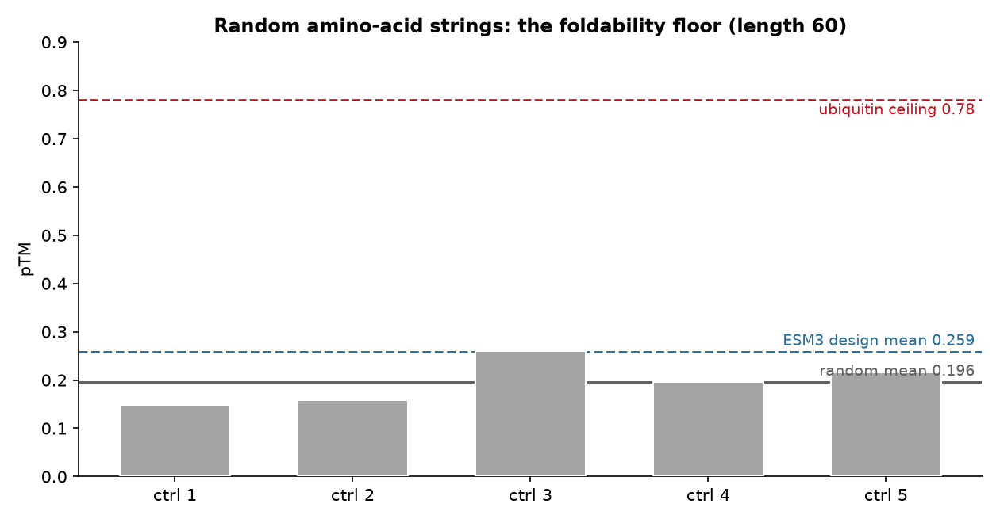

# Baseline Report: Random-Sequence Foldability Floor

## 1. Summary of Findings

Five uniformly-random amino-acid strings of length 60 (seed 0, the negative
control from the skill's eval) were folded with ESMFold2
(`esmfold2-fast-2026-05`) to establish the **foldability floor** — what a
sequence with no design behind it scores. The result: **mean pTM 0.196** (range
0.148-0.261) and **mean pLDDT 0.433** (range 0.406-0.462). This is deliberately a
**negative result**: random strings do not fold to a defined structure, but
ESMFold2 still assigns them non-zero confidence, so this floor is the reference
every de novo design must be measured against. Critically, the floor **overlaps**
the unconditioned ESM3 designs (mean 0.259): the best random control here
(pTM 0.261) exceeds the mean design, which is why a de novo campaign must compare
means over multiple samples rather than trusting any single draw.

## 2. Setup

- **Objective**: quantify the pTM/pLDDT floor for a non-design at length 60
- **Input**: `random_sequences(n=5, length=60, seed=0)` — uniform over the 20
  canonical amino acids, identical to `evals/eval_esm3_protein_design.py`
- **QC fold**: `esmfold2-fast-2026-05` (same model used to QC every design)
- **No ESM3 involved**: these are controls, not designs

## 3. Random Controls (QC Metrics)

| Control | pTM | mean pLDDT | Sequence |
| :------ | :--- | :--------- | :------- |
| random_1 | 0.148 | 0.406 | `PQCKTSPLSNWHTFLFEYKVYFLEDMSVENQMYHVSRTKCVADPAYSMIMDHWIIFVRDD` |
| random_2 | 0.158 | 0.408 | `MTSELVLEVMVHYVWLRDYPMWILGHGCYKSDDFFCDVPTKTIHWQWKRSNDMYESWMHI` |
| random_3 | 0.261 | 0.453 | `AKEINGMQCEFICWVYDAEHYWEPDNECYAHGESHCAVQYEKDIDLNQGCTRCYEPHKNS` |
| random_4 | 0.196 | 0.437 | `WGHCGGMTKEYRGASQWTLNPKFVARDMCVKFISNYLNWYFLPQDAYHMGIIRPWQCPWQ` |
| random_5 | 0.216 | 0.462 | `CGRDKGRTSVYACSMLRCQHVDFAPQMAHAATYEHEYHLKGESPDAKREKFTNEFKACCH` |
| **mean** | **0.196** | **0.433** | — |

## 4. The Floor in Context

*Fig 1: pTM of the five random 60-mers (gray bars) against three reference lines:
the random mean (0.196, solid gray), the ESM3 de novo design mean (0.259, teal
dashed — see `denovo_design/`), and the ubiquitin ceiling (0.78, red dashed, a
real protein of comparable length). The random controls sit far below a real
protein, the design mean sits just above the random mean, and control 3 (0.261)
pokes above the design mean — the honest overlap at length 60.*

## 5. Interpretation

Two facts make this control indispensable:

1.  **The floor is not at zero.** ESMFold2 returns pTM ~0.2 and pLDDT ~0.43 for
    pure noise. Any interpretation of a design's pTM that ignores this will
    over-credit the design. "pTM 0.3" is barely above noise at length 60, not
    evidence of a fold.
2.  **The floor overlaps the designs.** Because the best random control (0.261)
    beats the mean design (0.259), no single 60-mer — designed or random — can be
    called "folded" on its own. Only the *mean* separation (0.259 vs 0.196 on pTM;
    0.587 vs 0.433 on pLDDT) shows ESM3 is adding foldability, and even that
    margin is modest.

The scientific-integrity lesson: **reporting this floor is a result**, and
reporting a de novo design *without* it is incomplete. It also sets the bar for
when conditioning is worth it — the `motif_scaffold/` design clears the floor by
0.78 pTM, which is the kind of daylight a confident design needs.

## 6. Limitations

This floor is specific to **length 60** and to `esmfold2-fast-2026-05`; pTM is
length-sensitive, so a longer design has a different (generally higher) floor.
Five controls is a small sample — enough to place the floor near 0.2, not enough
to pin its variance precisely. The point is calibration, not a published
constant.

## 7. Conclusion

Random 60-mers fold to **mean pTM 0.196 / pLDDT 0.433** — non-zero, and
overlapping the unconditioned ESM3 designs. **Verdict: this is the floor; quote
it next to every de novo pTM, and treat a design as "folding" only when it
clears the floor by a real margin.** A campaign that does not beat this floor has
produced nothing over a random string generator.

*This baseline was produced with the `esm3-protein-design` skill's negative
control.*
