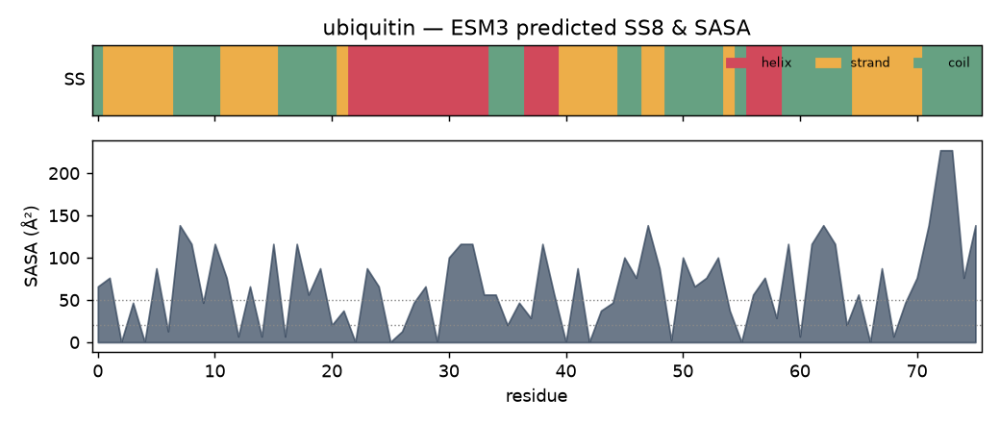
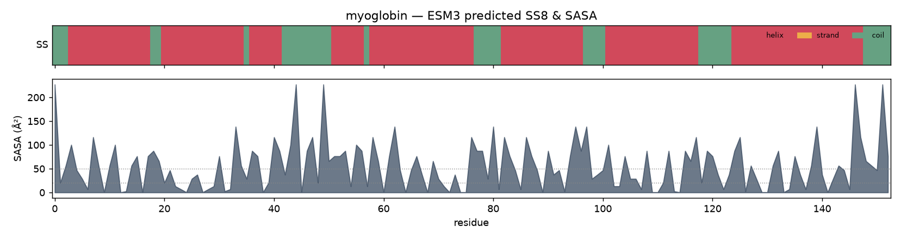

# Fold topology from sequence: β-grasp ubiquitin vs all-α myoglobin

*Predicted with `esm3_secondary_structure_sasa` (ESM3 `esm3-open-2024-03`,
`--temperature 0.1`). These are ESM3 **predictions from sequence**, not
measurements from a structure.*

## 1. Summary

ESM3 was asked for per-residue secondary structure (8-state DSSP) and
solvent-accessible surface area for two proteins with opposite folds, from
sequence alone. It separates them cleanly:

| Protein | Length | Helix | Strand | Coil | Fold class |
|---|---|---|---|---|---|
| Ubiquitin | 76 aa | **23.7%** | **34.2%** | 42.1% | β-grasp (mixed α/β) |
| Myoglobin | 153 aa | **76.5%** | **0.0%** | 23.5% | all-α globin |

Ubiquitin comes back as a mixed α/β protein with **one** dominant α-helix at
**residues 23–34** and a β-sheet built from strands in both halves of the chain —
the β-grasp signature. Myoglobin comes back as an all-α protein: **76.5% helix,
zero strand**, its helices split into eight segments — the eight globin helices.
The SASA track agrees with basic biophysics in both: hydrophobic residues sit in
a buried core (ubiquitin hydrophobic mean **35.7 Ų**) while charged residues
face the solvent (ubiquitin charged mean **100.8 Ų**).

## 2. Ubiquitin — the β-grasp fold



**Secondary structure.** The SS8 string is

```
CEEEEEETTSCEEEEECCTTCBHHHHHHHHHHHHCCCGGGEEEEETTEECCTTSBTGGGTCCTTCEEEEEECCCCC
```

Reading the runs (1-indexed, inclusive):

-   **One α-helix at residues 23–34** — a clean 12-residue `H` run
    (`IENVKAKIQDKE`). This is the single well-known ubiquitin helix, and ESM3
    places it exactly where DSSP does on the crystal structure.
-   **β-strands** at residues 2–7, 12–16, 41–45, and 66–71, with shorter strands
    at 48–49 and 55. Strands 2–7 and 12–16 form the N-terminal β-hairpin; the
    rest complete the mixed β-sheet that grips the helix — the "β-grasp".
-   Two short **3₁₀-helices** (`G` in SS8) at 38–40 and 57–59, plus turns and
    bends between the strands.

The 8-state composition is 15.8% α-helix (`H`), 7.9% 3₁₀-helix (`G`), 31.6%
β-strand (`E`), 2.6% β-bridge (`B`), 15.8% turn (`T`), 2.6% bend (`S`), 23.7%
coil (`C`). Collapsed to 3-state that is 23.7% helix / 34.2% strand / 42.1% coil.

**Solvent accessibility.** SASA ranges from **0.4 Ų** (fully buried) to
**227.1 Ų** (fully exposed), mean **65.98 Ų**, with **17** residues in the
buried band (≤ 20 Ų) and **45** in the exposed band (≥ 50 Ų). The most buried
positions are the core hydrophobics **Ile3, Val5, Val26, Ile30** (all 0.4 Ų) —
the residues that pack the hydrophobic core against the helix. The single
tallest SASA spike is the **C-terminal LRGG tail (Leu73, Arg74 at 227.1 Ų)**,
the fully solvent-exposed conjugation motif — visible as the large peak at the
right edge of the profile.

## 3. Myoglobin — the all-α globin fold



**Secondary structure.** The SS ribbon is almost solid helix (red) broken only
by short coil segments — and it contains **no strand at all** (0.0%). ESM3
resolves the helix into **eight segments**: residues 4–18, 21–35, 37–42, 52–57,
59–77, 83–97, 102–118, and 125–148. That eight-helix layout is exactly the
canonical globin A–H helices. The 8-state composition is 68.6% α-helix (`H`),
3.9% 3₁₀-helix (`G`), 3.9% π-helix (`I`), 10.5% turn, 0.7% bend, 12.4% coil —
76.5% helix once collapsed to 3-state, and **0% strand**.

**Solvent accessibility.** SASA mean **56.02 Ų** with **44** buried and **73**
exposed residues; the same 0.4–227.1 Ų span as ubiquitin. The profile shows the
alternating buried/exposed pattern of amphipathic helices packing against each
other, with the termini and inter-helix loops carrying the largest values.

## 4. The buried-core signal (hydrophobic vs charged)

Averaging SASA by residue chemistry recovers the textbook rule that a folded
protein buries its greasy residues and exposes its charged ones. For ubiquitin:

| Residue class | Residues scored | Mean SASA | Band |
|---|---|---|---|
| Hydrophobic (A I L M F W V C) | 25 | **35.7 Ų** | buried–intermediate |
| Charged (D E K R) | 22 | **100.8 Ų** | exposed |

Hydrophobic residues are, on average, **~65 Ų more buried** than charged ones —
a 2.8× difference. Myoglobin shows the same split (hydrophobic **26.4 Ų** vs
charged **98.9 Ų**), confirming the pattern is not ubiquitin-specific. This is
the qualitative check that the SASA track is doing real work rather than emitting
a flat profile.

## 5. What this shows — and its limits

-   **Topology class is recovered from sequence.** A β-grasp (mixed α/β) and an
    all-α globin are separated by the SS8 track without any structure input:
    ubiquitin keeps its lone helix and its sheet; myoglobin is all helix, no
    strand.
-   **The one helix lands in the right place.** ESM3's ubiquitin helix is exactly
    residues 23–34, matching the crystallographic helix — not scattered noise.
-   **SASA carries burial information.** Hydrophobic core residues drop to 0.4 Ų;
    the exposed C-terminal tail reaches 227.1 Ų; the class averages obey the
    hydrophobic-in / charged-out rule.
-   **These are predictions, not measurements.** ESM3 infers SS8 and SASA from
    sequence; it does not compute them from coordinates. If you already have (or
    fold) a structure, measure SS/SASA from it with `esm-protein-tracks`
    (DSSP/geometry) instead of predicting them here. Treat the buried / exposed
    labels as a convenience — they are thresholds on **absolute** Ų (buried
    ≤ 20, exposed ≥ 50) and a large residue exposes more area than a small one at
    the same relative burial. Report the numeric Ų, as done above.
