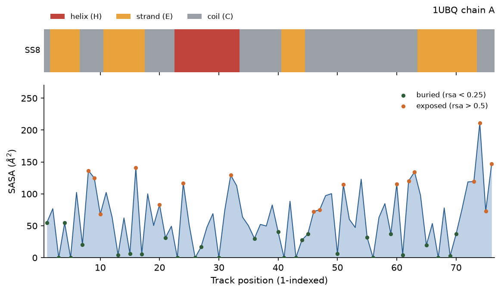

# Tracks Report: Ubiquitin (PDB 1UBQ, chain A)

## 1. Summary

`extract` pulled ESM3's five conditioning tracks out of **1UBQ chain A** — 76
residues of human ubiquitin — as pure local computation: no model, no API key,
no credits. The extracted **sequence is ubiquitin, character for character**
(`MQIFVK…LRGG`). `build-prompt --keep 10-20` then masked those tracks into a
scaffolding prompt that keeps **11** residues and masks **65** on every track.

| Step | Command | Cost |
|---|---|---|
| Extract | `extract --pdb-id 1UBQ --chain A` | free (local) |
| Inspect | `inspect --tracks 1ubq_tracks.json …` | free (local) |
| Prompt | `build-prompt --keep 10-20` | free (local) |

## 2. Visual Analysis

**Interpretation:**

-   **SS8 ribbon (top):** one red helix at positions 23–33 packed against four
    orange strands (2–6, 11–17, 41–44, 64–73) — the alpha/beta beta-grasp fold.
    Everything else is grey coil.
-   **SASA profile (bottom):** the blue trace is *absolute* solvent accessibility
    in Ų. Green dots mark buried residues (RSA < 0.25); orange dots mark exposed
    ones (RSA > 0.50). The troughs near 0 Ų are the hydrophobic core; the tall
    peak at position 74 (Arg74, 211 Ų) is the exposed C-terminal tail bearing
    the LRGG conjugation motif.
-   **SS8 caveat:** this ribbon is biotite's P-SEA, an SS3 (helix / strand /
    coil) approximation written into the SS8 alphabet as `H` / `E` / `C`. The
    states `G`, `I`, `T`, `B`, `S` are never produced. It is not DSSP.

## 3. The Extracted Tracks

| Track | Extracted value |
|---|---|
| `sequence` (L = 76) | `MQIFVKTLTGKTITLEVEPSDTIENVKAKIQDKEGIPPDQQRLIFAGKQLEDGRTLSDYNIQKESTLHLVLRLRGG` — equals the ubiquitin reference, exactly. |
| `coordinates` (76, 37, 3) | 602 atoms present; 76/76 residues backbone-complete; 0 residues unresolved (1UBQ is fully resolved). |
| `secondary_structure` (SS8) | 14.5% helix (11) / 34.2% strand (26) / 51.3% coil (39); alphabet used is only `{C, E, H}`. |
| `sasa` (Ų) | mean 63.19, median 61.22, min 0.00, max 211.13; **28 buried / 31 intermediate / 17 exposed**. |
| `function` | none — `--predict-function` was not used, so the field is `null` (that flag is the skill's only billed call). |

The SS composition is exactly what a beta-grasp fold should give: a substantial
strand fraction, a single alpha-helix, and no third structural class. The 28
buried residues are the real hydrophobic core; a folded domain must have one.

## 4. The Masked Prompt (`--keep 10-20`)

`--keep` names what SURVIVES. Because ranges are 1-indexed and inclusive,
`10-20` selects track positions 10 through 20 — **11** residues — and masks the
other **65** on every conditioned track:

| Track | Masked value | Masked / L |
|---|---|---|
| `sequence` | `'_'` | 65 / 76 |
| `coordinates` | `NaN` → JSON `null` | 65 / 76 |
| `secondary_structure` | `'_'` | 65 / 76 |
| `sasa` | `None` / `null` | 65 / 76 |

The kept window is `GKTITLEVEPS` (SS8 `CEEEEEEECCC`) — strand β2 (positions
11–17) with its flanking coil, including Lys11 (K11). The surviving prompt
sequence is:

    _________GKTITLEVEPS________________________________________________________

Every other track carries the identical 11-position window. The script prints
`masked per track: sequence 65/76, coordinates 65/76, secondary_structure 65/76,
sasa 65/76` and records `kept_positions` = [10…20]. **Report those numbers; do
not recount them by eye.**

## 5. Conventions That Matter

**1-indexed, inclusive.** `10-20` is the 10th residue through the 20th — 11 of
them, the biology convention. This is the single easiest thing to get wrong:
`--keep 10-20` maps to `sequence[9:20]`, not `[10:20]` and not `[10:21]`.

**Position vs. residue-id.** By default ranges count **track positions**, 1..L
along the extracted sequence. 1UBQ happens to number its residues 1..76, so here
`kept_positions` and `kept_residue_ids` are identical — both [10…20]. That
coincidence does not hold in general: calmodulin 1CM4 starts at residue 4, so
track position 10 is author residue 13. A number taken from a paper or a PDB
entry is an author number → pass `--index residue-id` to address it.

**Masking is per-track and fixed.** Sequence and SS8 mask to `'_'`; coordinates
mask to `NaN` (serialised as JSON `null`); SASA masks to `None` / `null`. A track
you leave out of `--condition-on` is emitted FULLY masked — same length, zero
information — which is how you tell ESM3 to condition on nothing there. Here all
four tracks were conditioned, so `fully_masked_tracks` is empty.

## 6. What Consumes This Prompt

The prompt's `sequence`, `secondary_structure`, `sasa` and `coordinates` keys map
1:1 onto `BiohubClient.generate(...)` keyword arguments. Two sibling skills take
it from here:

-   **`esm3-protein-design`** — hands the whole prompt to ESM3 to fill in the 65
    masked positions, scaffolding new sequence and structure around the kept
    strand-β2 motif.
-   **`esm3-inverse-folding`** — takes a coordinates-only prompt (build it with
    `--keep 1-76 --condition-on coordinates`, which keeps all 76 backbones and
    masks the sequence entirely) and recovers a sequence for the fixed backbone.
    On this exact backbone it recovers ubiquitin's native sequence at 100%
    identity.

This skill stops at the prompt. It never folds, designs, or generates anything —
those are the consumers' jobs.
