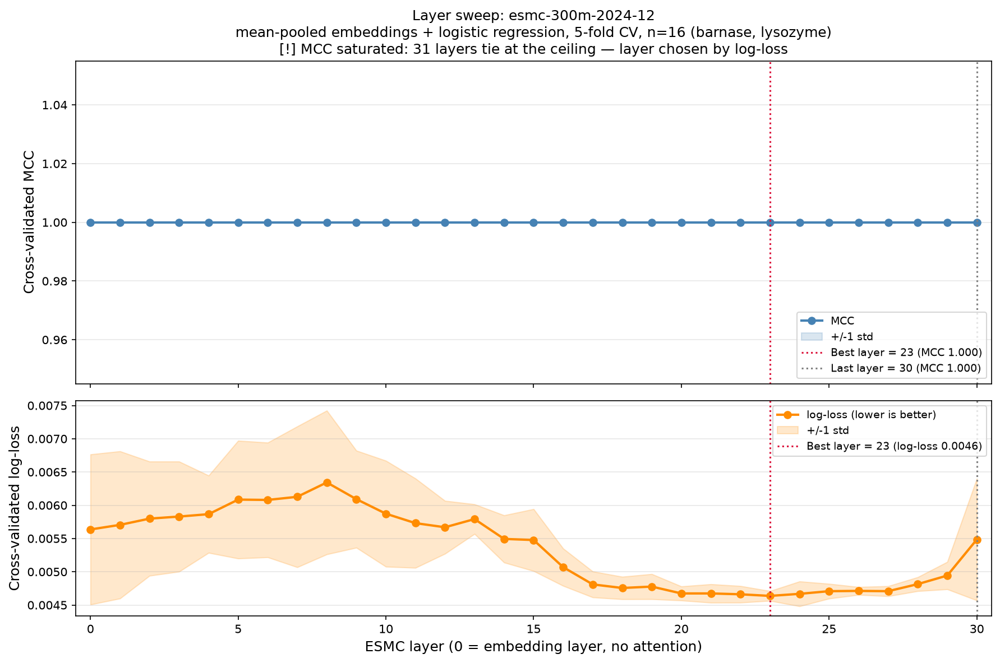

# Layer Sweep Report: lysozyme vs barnase (ESMC 300M)

## 1. Summary

A layer sweep over **esmc-300m-2024-12** picks **layer 23 of 30** (the output of
transformer block 23, **77% of the way through the network**) as the best layer
for separating two protein families. Every one of the **31 layer rows reaches
MCC = 1.000** under 5-fold cross-validation, so MCC is **saturated** and cannot
rank the layers on its own. The sweep breaks the tie with cross-validated
**log-loss**, which still varies: it bottoms at **0.0046 at layer 23**, is
higher at the **final layer (0.0055)**, and higher still at the **embedding
layer (0.0056)**. The embedding layer is never crowned, and the final layer
degrades relative to the deep-middle plateau — exactly the shape the sweep
exists to expose. This analysis was produced by the `esmc-embedding-layer-sweep`
skill and run entirely from recorded cassettes (no API credits).

## 2. The dataset

-   **Sequences (n = 16)**: 8 single-point mutants of hen egg-white lysozyme
    (P00698) and 8 of barnase (P00648), each labelled by its family. Two
    unrelated folds — a c-type lysozyme and a microbial ribonuclease — that
    share no evolutionary relationship.
-   **Model**: `esmc-300m-2024-12` → 30 transformer blocks + 1 embedding layer =
    **31 layer rows**, hidden dim **960**.
-   **Cost**: one `mean_hidden_states` request per sequence returns *all 31
    layers at once*, so the whole sweep is **16 requests**, not 16 × 31.
-   **Probe**: `StandardScaler` + L2 logistic regression (`C = 0.1`), scored by
    Matthews correlation coefficient under `StratifiedKFold(n_splits=5)`.

## 3. The sweep result

| Layer | Role | MCC (mean ± std) | Log-loss (mean) |
|---|---|---|---|
| **23** | block 23 (best) | **1.000 ± 0.000** | **0.0046** |
| 30 | block 30 (final) | 1.000 ± 0.000 | 0.0055 |
| 0 | embedding (no attention) | 1.000 ± 0.000 | 0.0056 |

**The MCC-saturation trap.** All 31 layers tie at MCC = 1.000
(`mcc_saturated: true`, `n_layers_tied_at_best_mcc: 31`). Lysozyme and barnase
are so far apart that even **layer 0** — raw token embeddings, i.e. amino-acid
composition with no attention — separates them perfectly. A naive `argmax` over
the tied MCC vector returns the *lowest* index first: the sweep's own
`top5_layers` ranked by MCC is `[0, 1, 2, 3, 4]`, which would hand back the
embedding layer, the worst possible advice. The script does not do this; it
falls back to log-loss (`selection_metric: "log_loss (MCC tied across
layers)"`), a strictly proper score with headroom above a perfect
classification.

## 4. Visual analysis

**Top panel — MCC.** A flat line at 1.000 across every layer. There is nothing
to read here: the classification is already perfect everywhere, so the curve has
no power to rank layers. This flatness is the signal to drop to the second
panel.

**Bottom panel — log-loss (lower is better).** The informative curve. It starts
mediocre at the embedding layer (0.0056), rises to a local *worst* around
layer 8 (0.0063), then descends into a broad minimum plateau across layers
~16–29 (≈ 0.0047), reaching its lowest point at **layer 23 (0.0046)**. It then
climbs back up at the **final layer (0.0055)** — the visible up-tick with a wide
error band on the right edge.

## 5. Interpretation

-   **The best layer sits at ~3/4 depth, not at the end.** Family / homology
    identity is a high-level functional property; it is decoded most confidently
    in the deep-middle of the network (layer 23 / 77% depth), matching the
    tutorial's "~3/4 of the way through" rule of thumb for functional
    similarity.
-   **The final layer degrades.** Log-loss at layer 30 (0.0055) is worse than
    the entire layers-16–29 plateau. The last layer is specialised to ESMC's
    masked-token training objective, not to your task, so it routinely gives up
    signal. This is the whole point of running a sweep instead of defaulting to
    the last hidden state.
-   **The embedding layer is not the answer.** Layer 0 ties on MCC only because
    the task has no headroom; on log-loss it is the second-worst row. A sweep
    that crowned it would be mis-reading a saturated metric.

**Scientific-integrity caveat.** MCC saturating on all 31 layers means this
16-sequence dataset **cannot actually distinguish the layers** — the log-loss
gaps (0.0046 vs 0.0056) are real but tiny, and layer 23 should be read as
*indicative, not definitive*. The honest conclusion a report must relay: to
commit to a layer with confidence, use a **harder or larger** dataset (more
classes, closer families, more sequences) so MCC has room to discriminate.

## 6. Conclusion

Use **`--layer 23`** for this task. More importantly, the sweep reproduces the
tutorial's headline finding on an independent dataset: **the last layer is not
the best layer**, the best layer lives in the deep-middle (~3/4 depth), the
embedding layer is never the right default, and when MCC saturates you read
**log-loss**, not the peak, to choose. Measure the layer; do not assume it.
