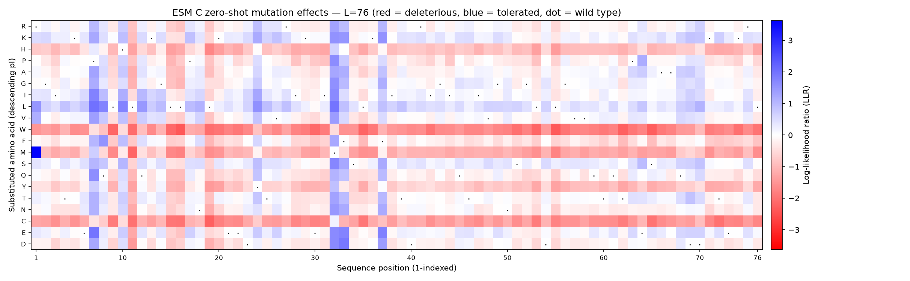
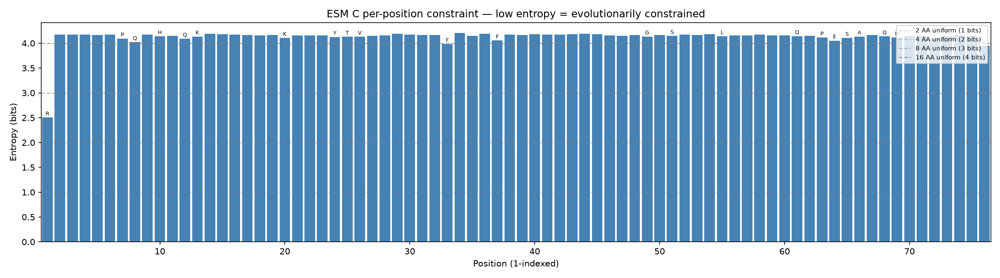

# Mutation Scoring Report: Scrambled Ubiquitin (Negative Control)

## 1. Summary of Findings

A leave-one-out scan of **shuffled ubiquitin** — the exact amino-acid composition
of ubiquitin with its residues randomly permuted, so no fold survives — on
`esmc-600m-2024-12` returns the clean signature of a **sequence that is not
protein-like**. Pseudo-perplexity is **18.70**, near the ~20 random ceiling and
**17.8× worse than real ubiquitin's 1.05**; wild-type recovery collapses to
**6.6%** (chance is 5%); and mean entropy is **4.12 bits**, hard against the
4.32-bit ceiling of total ignorance. The LLR matrix is pale and structureless on
a **±3.63** scale, four times flatter than ubiquitin's ±15.10. **This is a
valuable, reportable result:** the model is correctly telling us it has no idea
what belongs anywhere in this sequence. The one strong score — `R1M` at **+3.63**
— is a positional prior (position 1 "should" be Met), not a fitness gain.
Generated with the ESM C mutation-scoring skill.

## 2. Method & Context

- **Sequence**: `scramble(UBIQUITIN, seed=0)`, 76 aa — identical composition to
  human ubiquitin, fold destroyed by shuffling. The standard negative control.
- **Model**: `esmc-600m-2024-12`, leave-one-out masked-marginal scoring.
- **Whole-sequence fitness**: pseudo-perplexity **18.70** (mean wild-type
  log-probability -2.93); wild-type recovery **6.6%** — **a questionable, non-
  protein-like sequence**.
- **Constraint**: mean entropy **4.12 bits** (range 2.50–4.21); fraction-
  deleterious mean **0.60**, saturated at only **5 of 76** positions.

## 3. The Contrast (why this is a negative result)

The point of a control is the side-by-side. Every metric that reads "real
protein" for ubiquitin reads "noise" for its scramble:

| Metric | Ubiquitin | Scramble | Separation |
| :--- | ---: | ---: | :--- |
| Pseudo-perplexity | 1.05 | **18.70** | 17.8× |
| Wild-type recovery | 100% | **6.6%** | 15.2× |
| Mean entropy (bits) | 0.23 | **4.12** | ceiling is 4.32 |
| LLR heatmap scale | ±15.10 | **±3.63** | 4× flatter |
| Positions fully constrained | 76 / 76 | **5 / 76** | — |

**Observations:**

- **Magnitude**: the most deleterious substitution in the entire scramble is
  `L16W` at just **-2.38** — milder than ubiquitin's *best-tolerated* core
  changes. Nothing here is strongly constrained because there is no fold to
  constrain it.
- **Entropy near the ceiling**: at mean 4.12 bits the model's per-position
  distributions are almost uniform. The only position that dips is R1 (2.50 bits)
  — and that is the initiator-Met prior, not structure.

## 4. The Lone Positive Signal — a Flag, Not a Discovery

The single strongest score anywhere in the scramble is **positive**:

- `R1M` = **+3.63** (the model prefers Met over the shuffled Arg at position 1)
- next: `P7L` +1.99, `P7E` +1.98, `M32L` +1.98, `F33D` +1.91 — all small.

`R1M` is the **N-terminal initiator-methionine positional prior**: almost every
protein begins with Met, a fact ESM C has learned that is completely independent
of any fold. Per the interpretation guide, **a positive LLR is a flag to verify
against biology, never a beneficial-mutation claim.** Here it is a positional
artifact, not evidence that the scramble is "improved" by an N-terminal Met.

## 5. Figures

*Fig 1: The (76, 20) LLR matrix for the scramble. Compare with the ubiquitin
heatmap: this one is **pale and washed-out on a ±3.63 scale** (ubiquitin's was
saturated red at ±15.10). The faint horizontal bands — mild red on the W/C/M
rows, mild blue on L/I — are the model's **background amino-acid preferences**
(it mildly dislikes introducing Trp/Cys anywhere), not position-specific
constraint. The one saturated cell is `R1M` at position 1 (the initiator-Met
prior). There is no coherent per-position structure, because there is no fold.*

*Fig 2: Per-position entropy sits almost flat just above the 16-amino-acid
uniform line (4 bits) across the whole sequence, approaching the 4.32-bit ceiling
— the model is near-maximally unsure everywhere. Contrast ubiquitin, whose bars
mostly hug the floor. The lone dip is R1 (2.50 bits), the initiator-Met prior.*

## 6. Caveats

- This is a deliberately constructed negative control; the "finding" is the
  *absence* of protein-like signal, and that is exactly what should be reported.
- A positive LLR (R1M) reflects a positional prior, not a fitness gain — do not
  over-read it.
- As always, scores are unitless evolutionary likelihoods for ranking, not
  energies or clinical calls.

## 7. Conclusion

ESM C correctly identifies shuffled ubiquitin as **not protein-like**:
pseudo-perplexity 18.70 (vs 1.05 for the real sequence), 6.6% recovery, and near-
ceiling entropy of 4.12 bits. The takeaway for real work is procedural: **check
pseudo-perplexity first.** When it sits near the ~20 ceiling with entropy near
4.3 bits, the sequence does not look like a protein — report that plainly and do
not mine per-position "constraint" from uniform noise. And treat any lone positive
LLR, like the initiator-Met prior here, as a flag to verify rather than a result.
Generated with the ESM C mutation-scoring skill.
