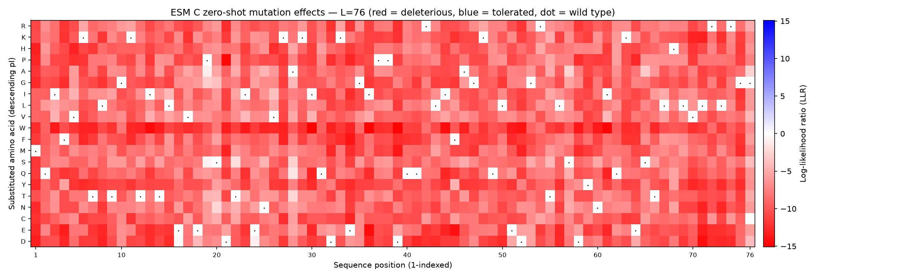
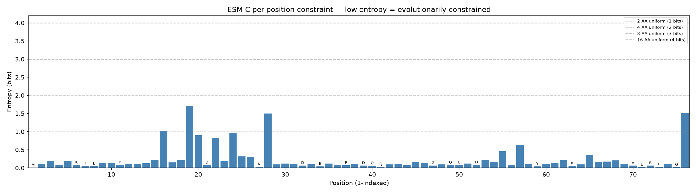

# Deep Mutational Scan Report: Ubiquitin (P0CG48)

## 1. Summary of Findings

A full leave-one-out scan of human ubiquitin (76 aa) on `esmc-600m-2024-12`
predicts a **heavily and cleanly constrained protein**. Whole-sequence fitness is
textbook — **pseudo-perplexity 1.05** with **100% wild-type recovery** (ESM C
names the correct residue at all 76 positions under masking) — and the
constraint has genuine structure: **mean entropy 0.23 bits** but ranging from
**0.007** at the invariant initiator Met to **1.70** at a flexible-loop proline.
The most damaging substitutions are large or charged residues forced into the
hydrophobic core (**I30W, LLR -15.10**), while the few permissive positions sit
on the surface. One position demands care: **G76**, the functionally essential
C-terminal conjugation residue, scores as one of the *most tolerant* in the
protein — a reminder that these are **evolutionary-likelihood rankings, not
energies or clinical calls**. Generated with the ESM C mutation-scoring skill.

## 2. Method & Context

- **Protein**: Human ubiquitin (UniProt P0CG48, 76 aa) — one of the most
  conserved eukaryotic proteins.
- **Model**: `esmc-600m-2024-12`, leave-one-out masked-marginal scoring
  (77 API calls).
- **Whole-sequence fitness**: pseudo-perplexity **1.05** (mean wild-type
  log-probability -0.05); wild-type recovery **100%** — a natural, well-
  recognised protein.
- **Constraint**: mean entropy **0.23 bits** (range 0.007–1.70); mean LLR over
  all **1,444** substitutions **-9.0**. This is the calibration baseline: in this
  protein, an LLR of -6 is *better than average*.

> [!NOTE] Because the protein is so conserved, **fraction-deleterious saturates
> at 1.0 at every one of the 76 positions** and cannot discriminate. All ranking
> below therefore uses **entropy** and the **LLR ordering**, which still separate
> the positions cleanly.

## 3. Most Constrained Positions (do not mutate)

Lowest entropy — the model is certain what belongs here (`most_constrained_positions`).

| Position | WT | Entropy (bits) | Note |
| :------- | :- | -------------: | :--- |
| M1  | Met | 0.007 | Initiator methionine; invariant (see variant M1P below). |
| G75 | Gly | 0.020 | Part of the C-terminal `LRGG` conjugation motif. |
| L71 | Leu | 0.021 | Packs into the hydrophobic core. |
| L73 | Leu | 0.030 | C-terminal tail, conserved. |
| K27 | Lys | 0.031 | Buried lysine forming internal hydrogen bonds. |
| Q41 | Gln | 0.033 | Conserved core position. |
| E34 | Glu | 0.042 | Conserved; mean LLR here -10.36. |
| Y59 | Tyr | 0.043 | Core aromatic. |
| L8  | Leu | 0.048 | Rim of the I44 hydrophobic patch (see L8A below). |
| T7  | Thr | 0.050 | Conserved. |

## 4. Most Tolerant Positions (candidates for mutation / library design)

Highest entropy — the model has real latitude here (`most_tolerant_positions`).

| Position | WT | Entropy (bits) | Note |
| :------- | :- | -------------: | :--- |
| P19 | Pro | 1.70 | Flexible loop; the single most tolerant position. |
| G76 | Gly | 1.52 | **Functionally essential** conjugation residue — tolerant by *likelihood*, not by function. See §7. |
| A28 | Ala | 1.50 | Surface. |
| E16 | Glu | 1.03 | Surface acidic. |
| E24 | Glu | 0.96 | Surface acidic. |
| S20 | Ser | 0.90 | Surface. |
| T22 | Thr | 0.83 | Surface. |
| S57 | Ser | 0.64 | Surface. |
| T55 | Thr | 0.46 | Surface. |
| S65 | Ser | 0.36 | Surface. |

## 5. Most / Least Damaging Substitutions

Extremes of the whole (76, 20) matrix, already ranked.

**Most deleterious** (`most_deleterious_substitutions`): `I30W` -15.10, `I36W`
-14.93, `D39W` -14.78, `I61W` -14.77, `D21P` -14.61, `I13W` -14.49, `L71D`
-14.39, `I36E` -14.37, `I44W` -14.31, `F45E` -14.06. The pattern is consistent:
bulky tryptophan or a charge (D/E) dropped onto a buried aliphatic (I13, I30,
I36, I44, I61) — or a proline forced into a strand (D21P).

**Best tolerated** (`best_tolerated_substitutions`): `G76C` -0.14, `E16D` -0.45,
`P19S` -0.78, `E24D` -0.98, `P19A` -1.03, `A28Q` -1.51, `T22S` -1.96, `S20N`
-2.42, `A28T` -2.45, `S57A` -2.65. All are conservative swaps at surface
positions (or the special case G76, §7). Note that even the *best* tolerated
substitution has LLR < 0 — nothing improves on wild type, as expected for a
protein under this much selection.

## 6. Named-Variant Read (`score-variants`)

Five variants of biological interest, ranked most to least deleterious. LLR is
paired with position entropy and with `rank_at_position` (where the substitution
sits among the 19 alternatives at its residue).

| Variant | LLR | Entropy (bits) | rank@pos | Best available here | Reading |
| :------ | --: | -------------: | :------- | :------------------ | :------ |
| M1P  | -12.83 | 0.007 | 17/19 | M1V (-9.06) | Proline into the invariant initiator Met — severe. Even the best swap here is strongly deleterious. |
| L8A  | -10.99 | 0.05  | 13/19 | L8I (-6.52) | Loss of a core hydrophobic on the I44 patch. |
| I44A | -10.79 | 0.08  | 11/19 | I44V (-5.51) | Guts the central residue of the canonical I44 hydrophobic recognition patch. |
| K48R | -5.29  | 0.10  | 1/19  | K48R (-5.29) | K→R is the *least-bad* substitution available at K48 (rank 1) yet still clearly deleterious — K48 anchors K48-linked polyubiquitin chains. |
| G76A | -2.80  | 1.52  | 2/19  | G76C (-0.14) | Mildest of the five, at a high-entropy position — but this is exactly the position to distrust (§7). |

The ranking is biologically sensible: the buried-core and initiator changes
(M1P, L8A, I44A) are far worse than the surface-exposed conservative swaps, and
the model's ordering matches the structural roles.

## 7. Figures

*Fig 1: The (76, 20) LLR matrix. Red = deleterious, blue = tolerated, white =
neutral; the dot marks the wild-type residue. The matrix is **saturated red on a
±15.10 scale** — nearly every substitution at nearly every position is
disfavoured, the visual signature of a heavily constrained fold. The deepest band
is the tryptophan (W) row: introducing a bulky W is damaging almost everywhere.*

*Fig 2: Per-position entropy. Low bars are evolutionarily constrained; dashed
reference lines mark uniform choice over 2/4/8/16 amino acids. Most of the protein
sits far below the 1-bit line (constrained), with isolated tall bars at tolerant
surface/loop positions (P19, A28) and — notably — at the functionally essential
G76.*

## 8. Caveats

- **Unitless.** LLR is a log-probability ratio, not an energy. No kcal/mol, no
  ΔΔG — use it to rank, which is what it is good at.
- **Likelihood ≠ essentiality.** **G76** is the crux: its C-terminal carboxyl
  forms the isopeptide bond to substrate lysines, so a protein without it is
  functionally dead — yet it is the **2nd most tolerant position** (entropy 1.52)
  and `G76C` is the **single best-tolerated substitution** in the whole scan
  (-0.14). The model is self-consistent — ubiquitin occurs in the training data as
  polyubiquitin and as ubiquitin-fusion precursors, where position 76 is followed
  by *more residues*, so the likelihood there is genuinely diffuse — but it is
  answering "what residue is likely here?", not "what does ubiquitin need to
  work?" Distrust tolerant calls at the termini and at known functional residues.
- **Sequence-only.** No structure, MSA, binding partner, or PTM is used. A residue
  critical only in complex (e.g. an interface) can look tolerant in isolation.
- **Not a clinical call.** These are evolutionary plausibility rankings, which
  correlate with but are not pathogenicity.

## 9. Conclusion

ESM C reads ubiquitin exactly as its biology predicts: an extremely constrained
protein (pseudo-perplexity 1.05, 100% recovery, mean entropy 0.23 bits) whose
buried hydrophobic core (I13, I30, I36, I44, I61) is essentially immovable and
whose few tolerant positions are surface loops. For library design, the
high-entropy surface positions (P19, A28, E16, E24, S20) are the safe candidates;
the core and the initiator Met are off-limits. The one call to override manually
is **G76**: tolerant by likelihood, indispensable by function. Generated with the
ESM C mutation-scoring skill; scores are for ranking, not stability estimates.
