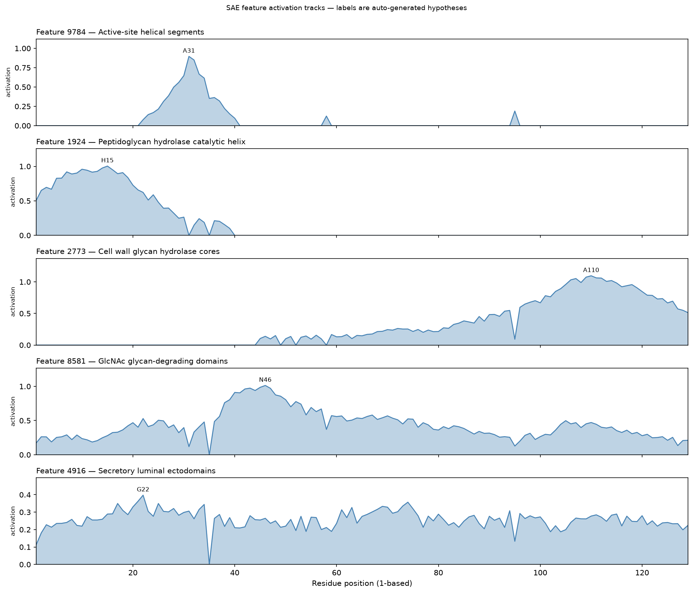

# SAE Feature Interpretation: Hen Egg-White Lysozyme (P00698, 129 aa)

> **SAE feature descriptions below are auto-generated hypotheses, not curated
> annotations.** A firing feature means the model *associates* a concept with a
> region; it is not evidence the protein has that function. Verify against
> UniProt/InterPro before treating anything here as fact. Analysis produced with
> the `esmc-sae-feature-interpretation` skill.

## 1. Summary of Findings

ESMC's sparse autoencoder decomposes lysozyme into a feature set the model
associates, almost uniformly, with **cell-wall / peptidoglycan glycan
hydrolases**. Nine of the ten top features by peak activation carry descriptions
mentioning peptidoglycan, muramidase, lysozyme, glycoside, hydrolase, or cell
wall. The dominant domain is feature **`2773`** ("Cell wall glycan hydrolase
cores"), which is #1 by max activation (1.097) and also #9 by prevalence
(82/129) — the signature of a feature that spans the catalytic core. The single
strongest trust signal: `2773`'s top database exemplar is **P00698 at 18.985**,
i.e. hen egg-white lysozyme itself. The prevalence ranking adds a broader,
non-catalytic reading — feature **`4916`** ("Secretory luminal ectodomains") is
on across 128/129 residues — consistent with a secreted, disulfide-rich
ectodomain. These are hypotheses the exemplars happen to corroborate strongly,
not assay results.

## 2. Run Context

-   **Protein**: Hen egg-white lysozyme (P00698), 129 residues
-   **SAE model**: `esmc-6b-2024-12-sae-layer60-k64-codebook16384`
    (ESMC: `esmc-6b-2024-12`, layer 60, k=64)
-   **Normalization**: `normalize_features=True` (TF-IDF; activations ~0-1.2)
-   **Distinct features fired**: 1,481 of 16,384 (9.04% of the codebook)

## 3. Top Features by Max Activation (motif-like / local)

*These spike at a few residues: candidate catalytic residues, binding motifs, or
short conserved patterns. Labels are auto-generated hypotheses.*

| #  | Feature | Hypothesised label | Category | Max act. | Prevalence | Peak residue |
| :- | :-- | :-- | :-- | :-- | :-- | :-- |
| 1  | `2773`  | Cell wall glycan hydrolase cores | Catalytic function | 1.097 | 82/129 | 110 |
| 2  | `8581`  | GlcNAc glycan-degrading domains | Domain | 1.013 | 128/129 | 46 |
| 3  | `1924`  | Peptidoglycan hydrolase catalytic helix | Post-transl. modification | 1.004 | 37/129 | 15 |
| 4  | `13520` | C-terminal peptidoglycan-binding segments | Domain | 1.003 | 104/129 | 126 |
| 5  | `12280` | Peptidoglycan catalytic cleft helix | Catalytic function | 0.944 | 50/129 | 91 |
| 6  | `3721`  | Peptidoglycan/chitin glycan-binding groove | Domain | 0.922 | 29/129 | 56 |
| 7  | `9784`  | Active-site helical segments | Catalytic function | 0.896 | 21/129 | 31 |
| 8  | `15389` | Lysozyme-like peptidoglycan hydrolases | Domain | 0.880 | 95/129 | 57 |
| 9  | `10893` | Substrate-binding loops at catalytic clefts | Domain | 0.726 | 30/129 | 77 |
| 10 | `12315` | Mature secretory lumenal domains | Domain | 0.664 | 127/129 | 40 |

**9/10 hit diagnostic lysozyme terms.** The lone exception is `12315` ("Mature
secretory lumenal domains") — a true but *generic* compartment signal, not
lysozyme-specific biology. That single miss is the honest reminder that not every
top feature is about catalysis.

## 4. Top Features by Prevalence (domain / family-like)

*These stay on across much of the chain: candidate fold class, domain identity,
compartment, or family signal.*

| #  | Feature | Hypothesised label | Max act. | Prevalence | On max list? |
| :- | :-- | :-- | :-- | :-- | :-- |
| 1  | `4916`  | Secretory luminal ectodomains | 0.397 | 128/129 | **no** |
| 2  | `8581`  | GlcNAc glycan-degrading domains | 1.013 | 128/129 | yes (#2) |
| 3  | `12315` | Mature secretory lumenal domains | 0.664 | 127/129 | yes (#10) |
| 4  | `13520` | C-terminal peptidoglycan-binding segments | 1.003 | 104/129 | yes (#4) |
| 5  | `9356`  | Mature extracellular domains | 0.280 | 100/129 | **no** |
| 6  | `2868`  | Cell-wall glycan-active enzymes | 0.423 | 96/129 | **no** |
| 7  | `15389` | Lysozyme-like peptidoglycan hydrolases | 0.880 | 95/129 | yes (#8) |
| 8  | `15699` | Cell wall glycanase catalytic groove | 0.643 | 87/129 | **no** |
| 9  | `2773`  | Cell wall glycan hydrolase cores | 1.097 | 82/129 | yes (#1) |
| 10 | `3453`  | Peptidoglycan recognition and remodeling | 0.343 | 75/129 | **no** |

**Read both lists.** Five features here never surface on the max-activation
ranking (`4916`, `9356`, `2868`, `15699`, `3453`). Feature `4916` in particular
tops the prevalence list yet peaks at only 0.397 — a broad, flat compartment
plateau that the max-activation view buries entirely, even though it is arguably
the clearest statement of what lysozyme *is*: a secreted, disulfide-rich luminal
ectodomain. Features on **both** lists (`2773`, `8581`, `13520`, `15389`,
`12315`) are the protein's dominant, chain-spanning domain.

## 5. Plots and Visual Analysis

*Fig 1: Per-residue activation of five representative features, ordered
local -> broad. Peak residue annotated; labels are auto-generated hypotheses.*

-   **`9784` "Active-site helical segments"** — a **sharp local spike** peaking
    at **A31** (~0.9), ~zero elsewhere (prevalence 21/129). The motif-like end of
    the spectrum: only max-activation ranking surfaces it.
-   **`1924` "Peptidoglycan hydrolase catalytic helix"** — a **regional block**
    over residues ~1-40, peaking at **H15** (~1.0). Its description hypothesises
    a catalytic helix inside a disulfide-bonded core.
-   **`2773` "Cell wall glycan hydrolase cores"** — a **broad dome** over the
    C-terminal half, peaking at **A110** (1.097). The dominant domain; high on
    both rankings.
-   **`8581` "GlcNAc glycan-degrading domains"** — **on across the whole chain**,
    peaking at **N46** (~1.0). A domain/family feature that is both high and
    broad.
-   **`4916` "Secretory luminal ectodomains"** — a **low, flat plateau** across
    the entire chain (peak G22, only 0.397). Broad but never spiking: visible
    only on the prevalence list.

The gradient from a single spike (`9784`) to a whole-chain plateau (`4916`) is
exactly why the skill emits two rankings.

## 6. Trust Assessment (per quoted feature)

| Feature | `top_swissprot` exemplars (activation) | Resembles lysozyme? | Peak vs its `threshold` |
| :-- | :-- | :-- | :-- |
| `2773`  | **P00698 (18.99)**, Q9D9X8 (18.49), P15132 (18.46) | **Yes — P00698 is lysozyme** | 1.097 >> 0.211 |
| `8581`  | P00719 (24.26), Q9HYC5 (23.51), O32130 (21.62) | Yes — lysozyme/muramidase entries | 1.013 >> 0.144 |
| `15389` | O32130 (22.45), Q9HYC5 (22.21), P15132 (22.00) | Yes — PG hydrolase entries | 0.880 >> 0.177 |
| `4916`  | P12247, Q96PQ0, Q99523 (~11) | No — sortilin/integrin/complement | 0.397 < 0.542 (**below threshold**) |

The catalytic features (`2773`, `8581`, `15389`) pass the trust check on both
counts. Feature `4916` is a legitimate *broad* signal but its peak (0.397) sits
**below its own threshold** (0.542), and its exemplars are unrelated secreted
receptors — so read it as a weak, generic "secreted ectodomain" cue, not as a
lysozyme-specific finding.

## 7. What the model does NOT tell you here

-   **No ground-truth function.** These features are associations, not
    annotations. For GO/EC/InterPro terms use **`esm3-function-prediction`**; for
    the curated record, UniProt **P00698**.
-   **No catalytic mechanism or activity.** The model associates a "catalytic
    helix" hypothesis with the N-terminal region; it does not establish that
    Glu35/Asp52 are the catalytic dyad. That is domain knowledge, not model
    output.
-   **No mutation effect.** The feature set is near-invariant to single
    substitutions — see the companion `specificity_control` example. Use
    **`esmc-mutation-effect-scoring`** to score a variant.
-   **One top feature is generic.** `12315` ("Mature secretory lumenal domains")
    is a compartment label, not lysozyme biology — the reason the diagnostic hit
    rate is 9/10, not 10/10.

## 8. Conclusion

ESMC's SAE represents hen egg-white lysozyme predominantly through features the
model *associates* with cell-wall / peptidoglycan glycan hydrolases, spanning a
sharp catalytic-helix motif (`9784`, `1924`) up to the chain-wide dominant domain
(`2773`, `8581`). The interpretation is unusually trustworthy for an
auto-generated one: the top feature's strongest database exemplar is P00698
itself, and 9/10 top features hit lysozyme-diagnostic terms while a broad
compartment feature and one generic label round out the set. Even so, every claim
above is a hypothesis corroborated by exemplars — not a curated annotation, a
mechanism, or a mutation-effect prediction.
