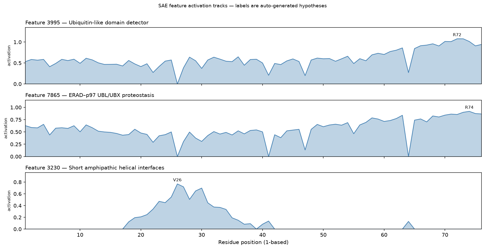

# SAE Feature Comparison: Lysozyme vs its E35Q Mutant vs Ubiquitin

> **SAE feature labels below are auto-generated hypotheses, not curated
> annotations.** Read them by their full `summary` and `top_swissprot`, not by
> keyword. Analysis produced with the `esmc-sae-feature-interpretation` skill.

## 1. Summary

This is the specificity control for the lysozyme positive case, plus a model
limitation. Two findings: (a) the SAE's descriptions are **protein-specific** —
lysozyme's diagnostic terms hit 9/10 of lysozyme's top features but **0/10** of
ubiquitin's, which instead activates an entirely ubiquitin-appropriate set led
by "Ubiquitin-like domain detector"; and (b) the Jaccard feature-set comparison
separates a **point mutant** (`jaccard = 1.00`) from an **unrelated protein**
(`jaccard = 0.02`). The catch, and the lesson: that 1.00 for the
activity-abolishing E35Q mutation means the feature *set* is a fingerprint of
**identity**, not a mutation-effect score.

## 2. Run Context

-   **Sequence A**: hen egg-white lysozyme (P00698), 129 aa
-   **Mutant**: lysozyme **E35Q** (catalytic Glu35 -> Gln; one residue changed)
-   **Sequence B**: human ubiquitin (P0CG48), 76 aa
-   **SAE model**: `esmc-6b-2024-12-sae-layer60-k64-codebook16384`; **top-N**: 50

## 3. Feature-Set Overlap (Jaccard)

| Comparison | Jaccard(top-50) | Shared / Union | Reading |
| :-- | :-- | :-- | :-- |
| lysozyme vs **E35Q mutant** | **1.00** | 50 / 50 | Near-identical machinery |
| lysozyme vs **ubiquitin** | **0.02** | 2 / 98 | Represented as unrelated proteins |

`jaccard(lysozyme, E35Q) = 1.00 >> jaccard(lysozyme, ubiquitin) = 0.02`. The two
features lysozyme and ubiquitin *do* share are **generic**, not biological:
`15425` ("C-terminal helix–tail motif") and `12315` ("Mature secretory lumenal
domains"). Unrelated proteins share only compartment/terminus cues.

## 4. Negative Control: Ubiquitin's Top Features (0/10 lysozyme terms)

*Ubiquitin activates a coherent, ubiquitin-appropriate set. None of the top 10
mentions peptidoglycan, muramidase, lysozyme, glycoside, hydrolase, or cell wall.*

| # | Feature | Hypothesised label | Max act. | Prevalence |
| :- | :-- | :-- | :-- | :-- |
| 1 | `3995` | Ubiquitin-like domain detector | 1.079 | 75/76 |
| 2 | `7865` | ERAD–p97 UBL/UBX proteostasis | 0.919 | 73/76 |
| 3 | `3230` | Short amphipathic helical interfaces | 0.769 | 24/76 |
| 4 | `2681` | Short beta strand-coil segment | 0.722 | 23/76 |
| 5 | `602`  | Acidic strand-loop docking patches | 0.709 | 25/76 |
| 6 | `5419` | Eukaryote-specific N-terminal module detector | 0.535 | 75/76 |

Feature `3995`'s strongest exemplars (Q6P9G0, Q5YKI7, Q15370) are all
ubiquitin-system proteins — the same `top_swissprot` trust check that pointed at
lysozyme (P00698) for the positive case now points squarely at the ubiquitin
system. Because lysozyme's terms fire 9/10 on lysozyme and 0/10 here, they are
**diagnostic, not boilerplate** — which is what makes the positive report
trustworthy.

## 5. Plots and Visual Analysis

*Fig 1: Per-residue activation of ubiquitin's top three features. Labels are
auto-generated hypotheses.*

-   **`3995` "Ubiquitin-like domain detector"** — on across nearly the whole
    chain, rising to a peak at **R72**, adjacent to the C-terminal `LRGG` (73-76)
    conjugation motif; consistent with the description's note that activation
    peaks toward the C-terminal diglycine.
-   **`7865` "ERAD–p97 UBL/UBX proteostasis"** — broadly on (peak **R74**),
    tracking the ubiquitin fold and its C-terminus.
-   **`3230` "Short amphipathic helical interfaces"** — a **local block** over
    residues ~17-40 (peak **V26**), coinciding with ubiquitin's single
    alpha-helix. A motif-like feature, cleanly localized.

None of these panels is a lysozyme feature; the model represents ubiquitin
through its own, disjoint machinery.

## 6. Interpretation & Caveats

> [!CRITICAL] **A high Jaccard means "same kind of protein", not "mutation is
> harmless".** E35Q abolishes lysozyme's catalytic activity, yet its top-50
> feature set is identical to wild-type (Jaccard 1.00). The per-residue
> activations *do* move under the mutation — and move most at residue 35 — but
> the *set* of top features is a coarse identity fingerprint that a single
> substitution does not perturb. To score a variant's effect, use
> **`esmc-mutation-effect-scoring`**, not this skill.

-   **Read descriptions, don't keyword-match them.** Ubiquitin's feature `7865`
    legitimately mentions peptide:N-glycanase (NGLY1/PNGase), so a naive "glycan"
    search would have wrongly tagged ubiquitin as glycan-active. Diagnostic terms
    were chosen only after reading full descriptions and confirming they do *not*
    leak onto the negative control; "glycan" and "disulfide" were rejected for
    exactly this reason.
-   **The descriptions remain hypotheses.** Even a 0/10-clean negative control is
    evidence of *specificity*, not of ground truth. For a curated annotation, go
    to UniProt / InterPro or **`esm3-function-prediction`**.

## 7. Conclusion

The SAE feature machinery is specific enough that an unrelated protein
(ubiquitin) shares essentially nothing with lysozyme (Jaccard 0.02, and 0/10 on
lysozyme's diagnostic terms), yet robust enough that an activity-abolishing point
mutant shares everything (Jaccard 1.00). That combination is what makes the
positive lysozyme interpretation credible — and simultaneously warns that the
feature set reports **identity, not mutation effect**, and that every label is a
hypothesis to be read in full and verified, never a curated fact.
