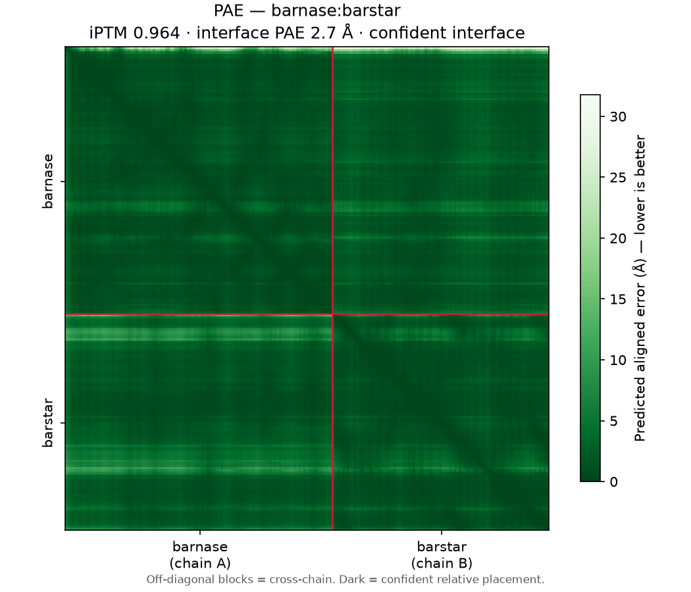
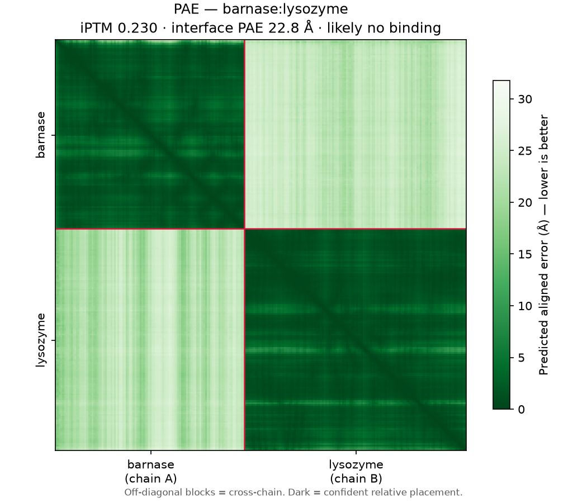
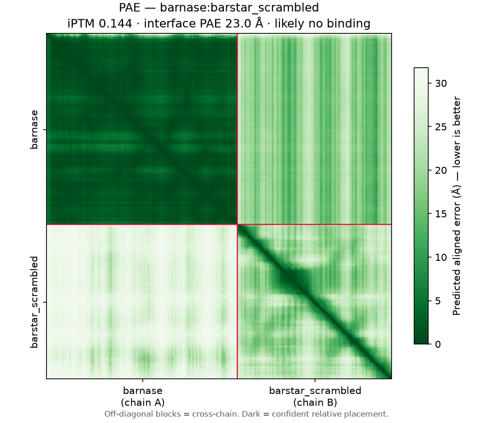

# Binder Screen: 3 candidates vs barnase

## 1. Summary & Shortlist

Three candidates were screened against barnase: its true inhibitor **barstar**,
an unrelated well-folded protein (**lysozyme**), and **scrambled barstar**
(barstar's composition, fold destroyed). Only barstar clears the confident-
interface band: **iPTM 0.964**, versus **0.230** for lysozyme and **0.144** for
scrambled barstar — both firmly in "likely no binding" (< 0.5). Applying
`--min-iptm 0.8` keeps **1 of 3** candidates and drops both decoys. iPTM is a
structural-confidence prediction to test experimentally, **not** an affinity or
Kd. This ESMFold2 binder-screening skill produced the screen.

**Shortlist (top-n 1):** barstar. *(lysozyme and scrambled barstar rejected — no
confident interface.)*

## 2. Screen Setup

- **Target:** barnase (110 aa) — chain A
- **Candidates:** 3 — one true binder + two negative controls
- **Model / params:** esmfold2-fast-2026-05, num_loops 3, num_sampling_steps 50
- **Ranked by:** iptm   **Filter demonstrated:** `--min-iptm 0.8`

## 3. Ranked Table

Real values from `results.csv`, sorted by iPTM.

| Rank | Candidate         | iPTM  | Verdict             | Interface PAE (Å) | Binder pLDDT | Confident contacts | Geometric contacts | Selection score | Shortlisted |
| :--- | :---------------- | :---- | :------------------ | :---------------- | :----------- | :----------------- | :----------------- | :-------------- | :---------- |
| 1    | barstar           | 0.964 | confident interface | 2.65              | 0.937        | **52**             | 52                 | 0.946           | ✓           |
| 2    | lysozyme          | 0.230 | likely no binding   | 22.76             | 0.897        | **0**              | 38                 | 0.441           | —           |
| 3    | barstar_scrambled | 0.144 | likely no binding   | 23.02             | 0.321        | **1**              | 39                 | 0.223           | —           |

*Ranked on iPTM. Contacts are the PAE-gated `confident_interface_contacts`; the
raw geometric column is shown only to expose the trap (see lysozyme).*

## 4. Per-Candidate Verdicts

### barstar — confident interface
- **iPTM 0.964** (> 0.8); **interface PAE 2.65 Å**; **52 confident contacts**.
- Binder folds: pLDDT 0.937 (yes). Interface is the real acidic-loop/active-site
  mode (barstar Asp35/Asp39 into barnase His102/Arg59/Arg83).
- **Action:** order. (Detailed in `../barnase_barstar/`.)

### lysozyme — likely no binding  ← the folding trap
- **iPTM 0.230** (< 0.5); **interface PAE 22.76 Å**; **0 confident contacts**.
- Binder folds: pLDDT **0.897 — high!** It folds better than many real designs
  and still does not bind. **Folding is not binding.** Its **38 raw geometric
  contacts** are incidental packing; every one fails the PAE gate → 0 confident.
- **Action:** drop. Do not be seduced by the pLDDT.

### barstar_scrambled — likely no binding  ← the composition trap
- **iPTM 0.144** (< 0.5); **interface PAE 23.02 Å**; **1 confident contact**.
- Binder folds: pLDDT **0.321 — fails to fold** (shuffling destroyed barstar's
  fold, same amino acids). Fails on *both* counts: cannot fold, cannot bind. Its
  lone "confident contact" is a spurious Arg59(barnase)–Arg79(decoy) pair — two
  like-charged arginines, chemically implausible — i.e. noise, not an interface.
- **Action:** drop.

## 5. Interface Evidence (PAE heatmaps)

The three heatmaps are the whole lesson in one picture. Off-diagonal blocks
(either side of the red line) are the cross-chain interface; dark = confident
relative placement.

*Fig 1 — barstar (binder): the entire matrix is dark, including the off-diagonal
cross-chain blocks. Confident interface.*

*Fig 2 — lysozyme (folds, does not bind): both diagonal blocks are dark (each
chain folds confidently) but the off-diagonal cross-chain blocks are pale/washed
out. The model knows each shape and has no idea how they fit together. This is
the canonical non-binder signature — learn it.*

*Fig 3 — scrambled barstar (neither folds nor binds): the barnase block stays
dark, but the decoy's own diagonal block is also pale (fold destroyed) and the
off-diagonal blocks are pale. Failure on both axes.*

## 6. Limitations

iPTM is a structural confidence, not a Kd — this screen ranks confidence in a
predicted interface, not affinity, kinetics, or specificity. Binder pLDDT and
geometric contacts are reported but must not be ranked on (see lysozyme).
`isoelectric_point` (barstar 4.37, lysozyme 9.21) is only a coarse
solubility/expression proxy. ESMFold2 folds one static complex; dynamic or
context-dependent binding is out of scope. This skill ranks candidates; it does
not design them.

## 7. Conclusion & Next Steps

Of the three, ESMFold2 predicts a confident interface for **only barstar**;
lysozyme and scrambled barstar are correctly rejected. The controls demonstrate
why the ranking discipline matters: a non-binder can fold well (lysozyme, pLDDT
0.897) and can show many raw contacts (38–39, versus barstar's 52), yet neither
is binding once you read iPTM, interface PAE, and PAE-gated contacts. For a real
campaign, order the shortlist (here, barstar) and confirm binding in vitro;
when nothing clears iPTM 0.8, report the empty shortlist as the honest result.
