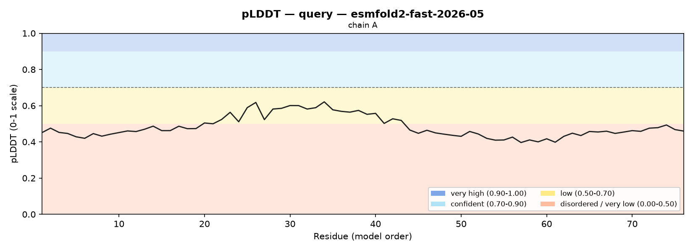

# Structure Prediction Report: scrambled ubiquitin (76 aa, negative control)

## 1. Summary

ESMFold2 (`esmfold2-fast-2026-05`, single sequence) predicts **no confident
structure** for a shuffled version of ubiquitin's 76 residues: mean pLDDT **0.48
on the 0-1 scale (48/100)**, pTM **0.24 (unreliable)**. The sequence has the
**identical amino-acid composition** to the real ubiquitin in the
`ubiquitin_fold` example — only the residue order is scrambled — so the collapse
from pLDDT 0.82 / pTM 0.78 to 0.48 / 0.24 is due to the destroyed fold alone.
**This is the correct answer, and an informative one**: it confirms the model is
responding to sequence *order* (structure), not composition, and it is exactly
what "no fold" looks like. Do not use this prediction for any downstream
structural analysis.

## 2. Input & Run Settings

-   **Sequence / source**: ubiquitin's 76 residues, shuffled (composition
    preserved, fold destroyed; deterministic seed 0)
-   **Model**: `esmfold2-fast-2026-05` (MSA used: no — single sequence)
-   **Settings**: num_loops 10, num_sampling_steps 50, include_pae no
-   **Outputs**: PDB `scrambled.pdb`, metrics `scrambled.json`

## 3. Global Confidence

| Metric           | Value            | Verdict                                     |
| :--------------- | :--------------- | :------------------------------------------ |
| Mean pLDDT (0-1) | 0.483 (48.3/100) | largely disordered or unfoldable            |
| pTM              | 0.238            | unreliable                                  |

-   **Overall**: *largely disordered or unfoldable — do not use for downstream
    structural analysis.* Mean pLDDT 0.483 is below the 0.50 boundary into the
    disordered band, and pTM 0.238 is well under the 0.5 "unreliable" cut-off. The
    global topology is not to be trusted at all.

## 4. Confidence Bands

Not a single residue reaches the confident band; roughly seven in ten are in the
disordered/very-low band. Contrast the real ubiquitin, which is 93.4 %
confident-or-better.

| Band                     | pLDDT (0-1) | Residues | Fraction |
| :----------------------- | :---------- | :------- | :------- |
| Very high                | > 0.90      | 0        | 0.0 %    |
| Confident                | 0.70-0.90   | 0        | 0.0 %    |
| Low                      | 0.50-0.70   | 23       | 30.3 %   |
| Disordered / very low    | < 0.50      | 53       | 69.7 %   |

## 5. Low-Confidence Regions

-   **chain A 1-76 (76 aa, the entire chain), mean pLDDT 0.483 — disordered.**
    There is no confident core to salvage; the whole sequence is one low-
    confidence region. `--include-pae` was not requested for this control, so no
    PAE heatmap was produced — but with pTM 0.24 the topology is unreliable
    regardless, and a PAE matrix would be uniformly high-error.

## 6. Comparison to the Real Fold

Same 76 residues, same composition, order scrambled. A real protein must beat its
own scramble on **both** metrics — and here it does, by a wide margin. This gap
is the calibration that proves the pipeline reads structure, not composition.

| Metric                       | Ubiquitin (real) | Scramble | Both worse? |
| :--------------------------- | :--------------- | :------- | :---------- |
| Mean pLDDT (0-1)             | 0.823            | 0.483    | yes         |
| pTM                          | 0.782            | 0.238    | yes         |
| Confident-or-better fraction | 93.4 %           | 0.0 %    | yes         |
| Disordered fraction          | 1.3 %            | 69.7 %   | yes         |
| pTM verdict                  | plausible fold   | unreliable | —         |

## 7. Plot

*Fig 1: Per-residue pLDDT (0-1 scale) with confidence bands shaded. The entire
trace stays below the dashed 0.70 cut-off, spending most of its length in the
orange "disordered / very low" band and never entering the cyan "confident" band.
Compare Fig 1 of the `ubiquitin_fold` example, whose trace rides the confident
band across the folded core — the same 76 residues, opposite result.*

## 8. Interpretation & Limitations

-   **This is a negative result, reported as one.** With pTM 0.24 and the whole
    chain disordered, there is no reliable structure to describe. No
    secondary-structure elements, "core", or pocket are claimed, because none can
    be trusted.
-   **Not suitable for any downstream structural work** — docking, Foldseek, and
    MD are all off the table for this prediction.
-   **Use this comparison as a template.** For a *designed* or unfamiliar sequence
    that matters, fold its scramble too: if the candidate scores like this
    control (both metrics collapsed), the model is telling you it has no confident
    fold. Confidence is not validity, but the *absence* of confidence is a clear
    stop signal.

## 9. Conclusion

The scrambled sequence produces no confident fold (mean pLDDT 0.48, pTM 0.24,
0 % confident residues), strictly worse than the real ubiquitin (0.82 / 0.78) on
every metric despite identical composition. This negative control is working as
intended: it demonstrates that ESMFold2 responds to sequence order, and it is the
canonical picture of "no structure" — a legitimate, useful scientific finding.
Prediction produced with the ESMFold2 structure-prediction skill on the Biohub
Platform.
