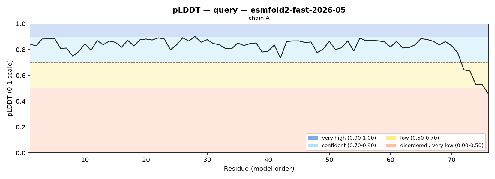
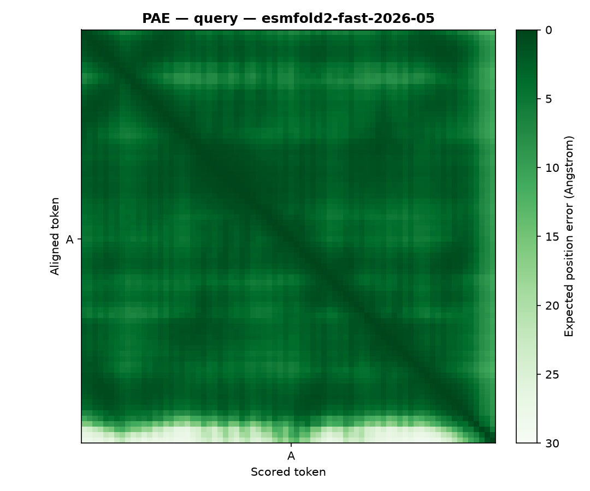

# Structure Prediction Report: ubiquitin (76 aa)

## 1. Summary

ESMFold2 (`esmfold2-fast-2026-05`, single sequence) predicts a **confident,
well-folded structure** for human ubiquitin from sequence alone: mean pLDDT
**0.82 on the 0-1 scale (82/100)**, pTM **0.78 (plausible fold)**. 93.4 % of
residues fall in the confident-or-better bands. The only low-confidence stretch
is the C-terminal `RLRGG` tail (residues 72-76), which is genuinely mobile in
solution — so this is a clean positive result with a biologically correct
flexible terminus, not a defect. The prediction is suitable for downstream
structural work over residues 1-71.

## 2. Input & Run Settings

-   **Sequence / source**: ubiquitin, 76 aa (human, UniProt P0CG48)
-   **Model**: `esmfold2-fast-2026-05` (MSA used: no — single sequence)
-   **Settings**: num_loops 10, num_sampling_steps 50, include_pae yes
-   **Outputs**: PDB `ubiquitin.pdb`, metrics `ubiquitin.json`

## 3. Global Confidence

| Metric           | Value              | Verdict                         |
| :--------------- | :----------------- | :------------------------------ |
| Mean pLDDT (0-1) | 0.823 (82.3/100)   | well-folded, confidently predicted |
| pTM              | 0.782              | plausible fold                  |

-   **Overall**: *well-folded, confidently predicted.* Mean pLDDT 0.823 is above
    the 0.70 cut-off and 93.4 % of residues are confident-or-better, so the
    global topology is trustworthy. pTM 0.782 sits in the "plausible fold" band
    (0.5-0.8) — the model is confident in the fold but has not locked the
    topology to the "confident fold" level (> 0.8), which is typical for a
    fast-model single-sequence run on a small domain.

## 4. Confidence Bands

93.4 % of the chain is confident-or-better; the residual is one short low-
confidence tail plus a single very-low residue at the chain end.

| Band                     | pLDDT (0-1) | Residues | Fraction |
| :----------------------- | :---------- | :------- | :------- |
| Very high                | > 0.90      | 1        | 1.3 %    |
| Confident                | 0.70-0.90   | 70       | 92.1 %   |
| Low                      | 0.50-0.70   | 4        | 5.3 %    |
| Disordered / very low    | < 0.50      | 1        | 1.3 %    |

## 5. Low-Confidence Regions

-   **chain A 72-76 (5 aa), mean pLDDT 0.558** — the C-terminal `RLRGG` tail. Its
    `LRGG` (residues 73-76) is the conjugation motif that ubiquitin uses to attach
    to substrates and is **mobile in solution**; a low pLDDT here is the model
    correctly reporting a flexible terminus, not an error. The globular body
    (residues 1-71) is entirely confident-or-better.

## 6. Plots

*Fig 1: Per-residue pLDDT (0-1 scale) with confidence bands shaded. The trace
rides in the cyan "confident" band (0.7-0.9) across residues 1-71, then drops
sharply through the dashed 0.70 cut-off at residue ~71 into the yellow "low" and
orange "very low" bands — the mobile C-terminal `RLRGG` tail. One confident
domain plus a flexible tail.*

*Fig 2: Predicted Aligned Error (Å); dark = confidently placed relative to each
other. The matrix is a single dark block: every residue in the body is confident
about every other residue's position — one rigid domain, no separate sub-domains
or hinges. The pale fringe along the last few rows/columns is the C-terminal
tail, whose position relative to the body is uncertain (high PAE), matching its
low pLDDT in Fig 1. Overall mean PAE 3.8 Å.*

## 7. Domain / Topology Reading

A **single rigid domain** spanning residues 1-71. The PAE heatmap shows one
contiguous dark block with no internal partitioning, so there are no separate
rigid sub-domains and no flexible inter-domain hinge. The only mobile element is
the C-terminal tail (72-76), consistent between the pLDDT dip and the bright PAE
fringe. This is the classic ubiquitin fold (a compact β-grasp) as expected.

## 8. Downstream Suitability & Limitations

-   **Safe for downstream work (docking, Foldseek, MD): residues 1-71.** Exclude
    the low-confidence C-terminal tail (72-76) from any rigid-body analysis.
-   **Confidence is not validity or function.** A confident fold of the wild-type
    sequence is expected; it does not by itself certify function — that is not
    what ESMFold2 measures.
-   **Single static conformation, single sequence.** This fast-model run used no
    MSA and returns one model; it does not enumerate conformational states.
-   Per-residue pLDDT is stored in the **PDB B-factor column, rescaled to 0-100**
    (here 45.8-90.1), so the structure can be coloured by confidence directly in
    PyMOL/ChimeraX.

## 9. Conclusion

ESMFold2 confidently predicts the ubiquitin fold from sequence alone: mean pLDDT
0.82 (0-1 scale, 82/100), pTM 0.78, a single rigid β-grasp domain over residues
1-71, and a correctly-identified mobile C-terminal conjugation tail (72-76). This
is a trustworthy positive result suitable for downstream structural analysis over
the ordered core. Prediction produced with the ESMFold2 structure-prediction
skill on the Biohub Platform.
